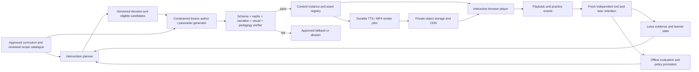

# Cogna Content Generation Engine — architecture and phased plan

**Status:** Proposed design, 1 October 2026. This is a build plan, not a claim that the engine is implemented. The active classroom contract remains [`docs/mvp-10.0/README.md`](../docs/mvp-10.0/README.md), including deterministic maths authority and separate diagnostic, assisted practice, and independent exit evidence. Any change to that contract needs an explicit amendment before implementation.

## 1. Goal and the simple explanation

**Goal:** Give each child the smallest verified teaching experience that addresses an evidenced need, then learn which experiences help that child solve a fresh problem independently.

An animation is not a unique film drawn for every student. Think of it as a reusable teaching component with inputs. A *balance scale* component can show many equations; a *factor-pair search* can show many trinomials. Cogna supplies verified numbers, the child's particular error, narration, pace, and a theme. Several components form a short lesson. The same visual recipe can play directly in the browser or be rendered into an MP4 when a fixed video is useful. Interactive questions remain part of the browser lesson even if its visual sections are also exported as video.

The reusable unit is therefore a **verified lesson recipe**, not a pile of prerecorded videos. This is how personalization and scale coexist: the library grows by mathematical idea and teaching move, while each instance changes its safe parameters. A new curriculum topic needs new reviewed ideas and visual components; it does not require a video editor to make one file per child.

The engine must answer four questions in order:

1. **Is teaching justified?** A single mistake may call for another check, not remediation.
2. **What is the smallest target?** Identify the first wrong step and its prerequisite, with uncertainty.
3. **Which experience is eligible?** Select a supported format, length, and recipe that can be verified for this skill.
4. **Did it help?** Use an unaided fresh exit item and later retention evidence; views, clicks, and game scores have different meanings.

## 2. What Cogna has now and what this adds

The production classroom lifecycle already separates Lotus diagnosis, personalized teaching, gamified practice, and independent exit. The current teaching path has an evidence-built lesson brief, an AI lesson author with a mathematical verifier, browser-played narrated animations, a rendered-video path, and server-scored practice. These are foundations, not yet one adaptive content engine.

| Existing foundation | Current limitation to address |
|---|---|
| [`lesson-brief.ts`](../apps/api/src/personalized-videos/ai-authoring/lesson-brief.ts) builds a bounded brief from confirmed factorisation evidence. | It prepares one lesson shape; it does not specify the smallest intervention across check, micro explanation, and full lesson. |
| [`lesson-verifier.ts`](../apps/api/src/personalized-videos/ai-authoring/lesson-verifier.ts) checks structured visuals, narration, practice, and exit maths. | Its current authoring limits assume a multi-scene lesson and 4–8 practice items. A micro format needs its own strict schema and checks. |
| [`AnimatedLessonPlayer.tsx`](../apps/web/src/app/student/personalized-video/AnimatedLessonPlayer.tsx) plays themed, narrated scenes with checkpoints. | The visual compositions need a shared catalogue and consistent controls across short and long interventions. |
| [`ModalityDirectorService`](../apps/api/src/engines/modality-director/modality-director.service.ts) selects approved assets for a concept and intent. | It chooses the newest matching asset, has a modality-fatigue TODO, and is not called by the present pilot lesson path. It is a starting point for a unified planner, not a production choice policy. |
| [`LocalRenderQueue`](../apps/api/src/personalized-videos/local-render-queue.ts), the renderer adapter, and S3 storage can produce and store MP4s. | The local queue is serialized and keeps job status on disk. Classroom-wide bursts need durable, bounded workers and a shared asset registry. |

Do not fork a separate product called “animations.” Extend the existing teaching path with a decision contract, a versioned content catalogue, a short-lesson format, and durable delivery operations. Keep the five existing `uiAction` values; animation/video/voice remain in `contentStyle` and parameters. A game is an interaction inside teaching or practice, not a new flat `uiAction`.

## 3. Who decides what: rules, AI, and the child

**Recommended architecture: governed AI inside hard boundaries.** Cogna starts with transparent rules. AI may propose a teaching focus and rank eligible experiences, but code validates the evidence and the final choice. Later, a promoted learned policy may rank the same eligible set after offline evaluation, shadow runs, and a controlled pilot. No model may invent a new action, choose an unreviewed visual component, bypass a prerequisite, or change the verified answer.

| Decision | Authority |
|---|---|
| Whether a skill gap is confirmed, and which maths facts are correct | Deterministic evidence rules and mathematical verifier; AI interpretation is a hypothesis where proof is incomplete. |
| Curriculum boundary, allowed recipes, age/language constraints, duration cap, accessibility, fatigue, asset approval, and fallback | Versioned server-side rules. |
| Candidate teaching approach, suitable example, explanation wording, narration, and ranking among *eligible* formats | Bounded AI generation or ranking, checked before use. |
| Voice on/off, captions, replay, theme, speed, and a choice among equally suitable approved formats | Child controls. These preferences never become claims about mathematical ability. |
| Whether the intervention worked | Fresh independent exit and later retention evidence, with uncertainty. A watched video or game score cannot establish mastery. |

In version 1, the AI can return an existing `recipeId` and safe parameters from an allowed list. The policy service rejects any choice outside that list and records a reason code. If the model times out, a rule-selected approved option is ready. The planner itself must not wait for a render job or an unconstrained model response on the student's answer path.

### Initial selection policy (proposed, to calibrate with educators)

| Evidence at decision time | Default next move | Why |
|---|---|---|
| One unexpected answer, unclear working, or conflicting evidence | One short discriminating question or targeted text hint | Do not diagnose a gap from an isolated slip. |
| Repeated first-step error on one micro-skill; prerequisites appear secure | Narrated micro animation, about 20–60 seconds, then one active check | Correct one precise misconception without a full lesson. |
| Same target remains uncertain after the micro check | A different representation or a prerequisite probe | Repeating the same animation may only repeat the failure. |
| Confirmed foundational prerequisite gap, several linked errors, or unsuccessful brief support | Sectioned guided lesson, initially budgeted at about 2–4 minutes, with pauses and checks | Rebuild the necessary idea in small steps. |
| Teaching check succeeds | 2–4 targeted interactive tasks, followed by a fresh independent exit | Practice applies the idea; exit tests unaided transfer. |
| Target is secure or there is insufficient evidence to prescribe teaching | Advance, offer an appropriate challenge, or gather more evidence | Do not force remediation. |
| Fatigue, accessibility need, unavailable media, provider failure, or failed verification | Shorter approved text/visual path, accessible alternative, or explicit abstention | Do not trade correctness or access for media. |

These are **policy defaults, not scientific thresholds**. The exact number of repeated errors, duration budgets, and fatigue cap must be fixed in a versioned rules file after educator review and tested against real and synthetic cases. The planner should use whole-session evidence, not only the last answer. Confidence in a misconception and expected benefit of a format are separate quantities.

## 4. The animation and interaction library

Build a catalogue at three levels. **Primitives** are small visual actions; **scenes** give one teaching step; **compositions** string scenes and checkpoints together. Each entry has a typed parameter schema, supported curriculum skills, mathematical invariant, accessibility alternative, review status, renderer version, and tests. Code owns how the component behaves; AI supplies only allowed content and parameters.

| Library family | Examples | Best use |
|---|---|---|
| Step highlight and reveal | Focus the incorrect symbol; reveal one transformation at a time; before/after comparison | Brief correction, low visual complexity. |
| Mistake microscope | Show the student's entered step beside the verified step; animate where the paths diverge | A specific evidenced misconception. |
| Algebra balance | Show equal operations on both sides, inverse operations, or a sign change | Linear equations and equality misconceptions. |
| Distribution and area | Animate a factor reaching every term; tiles or area grids for products | Brackets, expansion, factorisation. |
| Factor search | Show product/sum constraints, candidate pairs, and why a pair fails | Trinomials and sign patterns. |
| Common factor and structure | Pull out the greatest common factor; regroup terms; compare equivalent forms | Foundational factorisation steps. |
| Number line and graph movement | Show signed operations, coordinates, or change over time | Future topics only after topic-specific verification exists. |
| Worked example with pauses | A few linked scenes, one concept per scene, with checkpoints | Confirmed broader gap. |
| Retrieval and recap | A compact rule reminder and a fresh prompt without worked steps | Later review; never substitute for an independent assessment. |
| Interactive challenge | Spot the first wrong line, choose a factor pair, fill a missing step, build a solution | Practice after teaching or a low-stakes check. |

An animation should show a mathematical relationship that motion makes clearer. A static equation card is often better than movement. Motion must be pausable and have reduced-motion, caption, and text alternatives. For a child who opts out of voice, the same verified narration appears as text.

### Example of reuse

For `3(x + 4) = 21`, a micro recipe could combine `mistake-microscope` and `distribution`: highlight the child's `3x + 4`, animate `3` multiplying both `x` and `4`, then ask the child to expand a *different* bracket. For a child with a broader distribution gap, the guided lesson can reuse those same components plus an area scene and two checkpoints. Theme and voice change presentation; the mathematical invariant stays the same.

## 5. Target architecture

The main boundaries are:

1. **Learner evidence:** versioned observations, confirmed and suspected skills, prerequisite state, help received, and uncertainty. Each claim links to the original work. Personalization uses a minimal, pseudonymous brief; names and school details are excluded from model prompts unless strictly needed.
2. **Intervention planner:** a pure, replayable policy that produces an eligible list and final selection. It records `policyVersion`, evidence version, reason codes, and rejected candidates. An AI ranker can operate only within this list.
3. **Content catalogue:** reviewed recipes and visual components, with curriculum and verifier compatibility. `ModalityAsset` remains useful for approved reusable assets; personalized lesson instances must reference template/version and verification results.
4. **Generator and verifier:** structured `LessonSpec` output, never free-form code or arbitrary animation commands. Verify each instantiated mathematical claim, visual transition, spoken claim, checkpoint, practice answer, and held-out exit item. For a claim the checker cannot validate, use reviewed content or abstain.
5. **Delivery:** play JSON-driven scenes and cached narration immediately where possible. Render MP4 asynchronously for fixed lessons, offline needs, or devices that cannot run the interactive player. MP4 generation is not on the answer-to-next-screen critical path.
6. **Outcomes:** store lesson exposure and assisted attempts separately from independent exit and retention. The policy learner consumes an audited, privacy-controlled outcome dataset, not raw clicks as mastery labels.

### Contracts to introduce

`InterventionPlan` should contain `studentId` (internal), `assignmentId`, `evidenceVersion`, `sourceEvidenceIds`, `targetSkillId`, optional misconception code, diagnosis confidence, prerequisite state, `learningIntent`, selected experience (`CHECK`, `TEXT_EXPLANATION`, `MICRO_ANIMATION`, `GUIDED_LESSON`, `CHALLENGE`, or `ABSTAIN`), `recipeId`, duration budget, accessibility/presentation choices, reason codes, fallback, and `policyVersion`. It is internal orchestration metadata, not a new `LearningDecision.uiAction`.

`LessonSpec` should contain versioned scenes and beats, visual component IDs with typed parameters, exact narration/captions, checks with server-held answers, target skill, approved source references, and render profile. Both interactive playback and MP4 rendering consume this same spec. The interactive player owns pauses and answer submission; a plain MP4 cannot carry those controls.

Map these internal experiences onto existing contracts: a check or practice challenge uses `SHOW_QUESTION`; a text, micro, or guided explanation uses `SHOW_EXPLANATION` with `contentStyle.modality` and appropriate parameters. An abstention yields an approved evidence-gathering or safe fallback path. This keeps the UI action vocabulary stable.

Persist a `ContentInstance` or equivalent reference from the existing `PersonalizedVideoAssignment`, a durable job record using the existing `Job` pattern, immutable verification and render manifests, and an `InterventionDecision` record. Add playback/check events without treating client-only events as proof of completion. Use checked-in migrations and keep old assignments readable. Avoid copying the same learner data into every asset or cache key.

## 6. Content production and review

1. A curriculum owner approves the skill, objective, prerequisite graph, allowed methods, and source material.
2. A subject expert reviews each new visual recipe and its invariants, including misleading intermediate frames and accessibility alternative.
3. The planner creates a bounded brief from verified evidence; the generator fills an allowed recipe or writes structured scenes within a reviewed catalogue.
4. Validators check schema, mathematical equivalence and task completion, narration against visuals, language/tone, age/curriculum alignment, hint leakage, and that practice/exit items are new.
5. The system stores the input evidence references, prompt/model/version, recipe/version, validation results, content hash, generated audio and media refs, and approval state. Student delivery reads only a passed, immutable version.
6. Automated sampling and educator review inspect production outputs, with faster mandatory review for unsupported maths, a new recipe, or a verifier blind spot. One failed mandatory check blocks that instance.

The current verifier is valuable, but production readiness requires explicit coverage by topic and visual type. “The model produced a plausible explanation” is not verification. Captions and TTS must be generated from the same verified narration text so they cannot diverge. AI should never synthesize a spoken maths claim after validation without rechecking that final text.

## 7. Personalization and cold start

At cold start, use grade, assigned curriculum objective, accessibility/language settings, and the first verified diagnostic evidence. Choose a low-risk default, allow the child to adjust presentation, and describe uncertainty honestly. Do not classify the child as a permanent “visual” or “auditory” learner. Cohort data may be a prior for an eligible format, never proof about this child.

Update the learner state from: independent correctness and working, repeated first-step errors, support needed, checkpoint outcomes, practice attempts, pauses/replays, explicit preferences, and later retention. Weight these appropriately: independent transfer and retention are primary; playback and preference are secondary. Missing data stays missing. A choice of cricket or space theme is a preference signal, not a diagnosis.

Start with rules. After enough consented, representative outcomes, train or evaluate a ranker offline to predict which *eligible* intervention is most likely to produce independent success for a similar evidence state. Compare it with the rule baseline in shadow mode, test with educators and subgroup slices, then use a controlled experiment. Keep a kill switch and instant rule fallback. Avoid automatically optimizing for watch time, engagement streaks, or cheap media at the expense of learning.

## 8. How animations scale in production

**Reuse:** A library of tens of well-designed mathematical components can produce many examples by parameters and composition. Do not create or store one original video file for every student and every attempt. Reuse generic components, nonpersonalized scenes, voices, and assets; personalize only the necessary data. Content-address reusable assets by recipe/version, verified input hash, locale, voice, and theme. Do not put student identifiers or answers in a shared cache key or public URL.

**Playback first:** The existing Remotion Player can render parameterized compositions in React at runtime. Use that path for micro animations and interactive lessons so the child does not wait for an MP4 render. Preload the next verified scene and use an approved text/visual fallback if audio or animation fails. MP4 remains a delivery option, not the universal format. Remotion's [Player documentation](https://www.remotion.dev/docs/player) supports runtime-customized compositions; its [Lambda documentation](https://www.remotion.dev/docs/lambda) describes one cloud render option, subject to provider limits and cost.

While a child works on the current question, Cogna may prepare a few likely, verified next content candidates. It must commit to one only after the actual response and updated evidence are known. Stale candidates are discarded or safely reused as generic content; they must never override a new diagnosis.

**Rendering:** Put TTS and MP4 work on durable queues with idempotency keys, leases, retry budgets, dead-letter inspection, per-provider rate limits, and separate priorities for a waiting student versus batch work. Scale worker count against classroom burst load and actual measured render time. Keep web/API servers free of Chromium/FFmpeg jobs. The current local serialized render queue is suitable for development, not a multi-instance production queue. Use the renderer adapter so workers can move to containers or Remotion Lambda without changing the planner. Validate the provider's current limits, regional availability, licensing, and cost before choosing it.

**Storage and access:** Store immutable media by content hash in object storage, deliver through a CDN, and authorize per-student access to personalized assets. A private S3 origin with CloudFront origin access control and signed URLs/cookies is one supported pattern in [AWS documentation](https://docs.aws.amazon.com/AmazonCloudFront/latest/DeveloperGuide/private-content-overview.html). Retain shared generic assets separately from student-specific media, define expiry/deletion, encrypt at rest and in transit, and never expose private diagnostic details in filenames or public manifests.

**Capacity:** During a school launch, estimate `arrival rate × generation/render time`, then load-test the actual queue, TTS limits, object storage, and CDN. Set quotas per school and student, prebuild common recipes, cache safely, and shed expensive optional work before the teaching path stalls. Track p50/p95 lesson readiness and player startup, queue age, provider errors, verifier rejection, fallback rate, render cost, TTS cost, and cost per independently improved skill. Set numerical service targets from pilot measurements; do not claim a service level from code-path timing alone.

Provisional Phase 4 targets are: every selection has a durable decision record; no verified-content failure or cross-student media leak is accepted; the policy calculation stays under 250 ms at p95 after evidence is loaded; and an approved playable explanation or explicit unavailable state appears within 3 seconds at p95 on the declared pilot device/network. These are engineering starting points, to be revised from measured school conditions before becoming contractual service levels. Personalized rendering may continue asynchronously behind the fallback.

## 9. Phase-by-phase delivery plan

Each phase has one goal and a release gate. A phase is complete only when its gate is measured in the target environment; passing unit tests alone does not prove a production classroom flow.

| Phase and governing goal | Build | Release gate |
|---|---|---|
| **0 — Trustworthy inputs.** Decide from real evidence. | Freeze this design as an approved contract; define skill/evidence severity and uncertainty, intervention schema, reason codes, privacy/data retention, and educator-labelled cases. Audit Lotus evidence durability and verifier coverage for the first topic. | Educators agree on at least the slip, narrow misconception, prerequisite gap, no-gap, and insufficient-evidence cases; every planned intervention cites source evidence; no weak single error becomes a confirmed gap. |
| **1 — Reusable content library.** One idea supports many children. | Create versioned primitives, scenes, and composition schemas; build reviewed factorisation recipes; add the short `MICRO_ANIMATION` schema and player mode; keep existing longer lessons. | Vary numbers, mistakes, theme, voice, captions, and speed without changing code; every combination passes math/visual checks and desktop/mobile/reduced-motion review. |
| **2 — Governed selection.** Give the smallest suitable experience. | Introduce the pure Intervention Planner, explicit policy version, eligible candidate filtering, fatigue/cooldown and fallback, decision logging, and integration with classroom teaching assignment. | Replayable tests prove each decision-table case; AI cannot select outside the eligible set; no extra `uiAction`; a provider timeout returns an approved path. |
| **3 — Verified generation.** Safely fill the selected experience. | Extend the existing AI author and verifier to micro and full `LessonSpec`; validate visuals, spoken claims, checks, practice, fresh exit; add human review tools for new recipes/unsupported forms and immutable content manifests. | Zero known unchecked math or spoken/visual mismatch in the release corpus; deliberately bad maths/voice/visual fixtures are rejected; failure falls back or abstains visibly. |
| **4 — Durable classroom delivery.** Survive bursts and failures. | Replace serialized local render jobs with durable bounded workers; add cache/asset registry, private object storage/CDN access, auth, quotas, monitoring, alerting, and recovery; preserve the current classroom lifecycle. | Multi-device browser walkthrough; load test at a declared school/classroom burst; worker crash/retry and provider outage drills; no duplicate or cross-student asset delivery; the lesson remains available through safe fallback. |
| **5 — Measured personalization.** Improve independent learning. | Instrument decision, playback, checks, independent exit, and later retention; build offline comparison of eligible formats; run shadow ranking, educator audit, controlled pilot, and rollback. | Improvement is judged on fresh unaided work, with uncertainty and subgroup review; no promotion if math, access, privacy, or evidence separation gates fail. |
| **6 — Curriculum expansion.** Repeat without rebuilding the engine. | Add reviewed component/skill packs for the next topic, language variants where needed, and school-specific approved curriculum maps. | A new topic can be added through curriculum mapping, typed recipes, verifier coverage, and review; core planner/player/queue code does not need a topic-specific fork. |

### The first production slice

Start with factorisation and three experiences: a **brief check**, a **single-error micro animation**, and a **sectioned guided lesson**. Reuse the current spot-mistake and pair-hunt practice. Run the same fresh independent exit rule after either teaching format. This slice tests the architectural decision that matters most: Cogna can select *different amounts of teaching* from the same diagnostic system, without weakening verification or classroom reporting.

### Non-negotiable release invariants

- No generated maths, visual transition, spoken claim, question, or answer key reaches a child without the appropriate checker or review gate.
- The selected target is traceable to evidence; one isolated error does not become a permanent learner label.
- Assisted teaching and gamified practice never count as independent success.
- A fresh exit is independent, server-graded, and kept distinct from engagement and practice.
- Production never silently substitutes demo data; student and teacher ownership boundaries remain intact.
- Every decision, recipe, generator, verifier, and policy version is reconstructable and reversible.

## 10. Decisions to make before implementation

1. Approve the first content scope: **factorisation only** is recommended for the pilot.
2. Agree with a maths educator on the initial evidence thresholds and the exact micro and guided lesson length budgets. Treat the durations above as starting design limits, not proven optimums.
3. Decide which locales/voices and accessibility needs the first school pilot must support.
4. Pick the production media environment after measuring burst volume, provider limits, cost, and latency. The architecture permits browser-first playback plus either container render workers or a managed Remotion render provider.
5. Define consent, retention, and school access rules for student-specific narration and media before storing it outside the application database.

The next engineering artifact should be the Phase 0 contract and test corpus. Building more video styles before the intervention decision and evidence labels are reliable would make content production scale faster than teaching quality.
