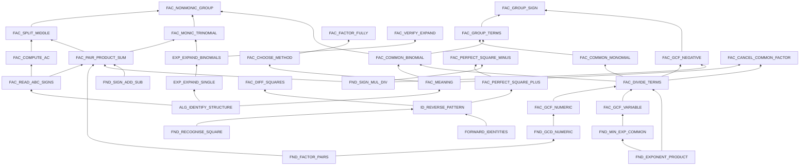

# Factorisation — skill map

**Status:** Design for step 1, 17 September 2026. Not implemented. This builds on the canonical catalogue in [`docs/diagnostic-microskill-slice/micro-skill-catalogue.md`](../docs/diagnostic-microskill-slice/micro-skill-catalogue.md) and keeps its skill IDs, its seven-layer evidence model, and its question-tagging method. It does not replace them.

**Scope:** Grade 8 CBSE, based on the NCERT Class 8 factorisation chapter: common factors, grouping, the three identities, monic trinomials `x² + bx + c`, and dividing with factors. Non-monic trinomials (`ax² + bx + c`, splitting the middle term) are Class 9 and are marked **stretch**, used only for students who are clearly ahead. Quadratic equations (Class 10) are out of scope. The NCERT books have been revised recently, so check this scope against the syllabus the school actually uses before building items.

Labels used below:

- `[code]` — already in `micro-skills.catalog.ts`, with a working checker
- `[catalogued]` — already in the 73-skill document, no code yet
- `[new]` — added here, with the reason given

---

## 1. How the map is shaped

Two levels, exactly as the existing model defines them:

- **Level 1 — skill group.** A named cluster, like "common factors." Used for the report headings and for deciding where the test goes next.
- **Level 2 — micro-skill.** The smallest thing you can gather evidence on and teach in one sitting. This is where the tree stops.

A mistake is **not** a skill. "Forgot the 1 when taking out the whole term" is a mistake inside the skill "divide every term by the factor." Mistakes are listed under their skill, not added as extra skills. This keeps the map small and stops it growing every time we discover a new error.

Difficulty is **not** a skill either. Easy, medium and hard versions of a skill change specific dials — signs, a coefficient other than 1, a square that isn't obvious, terms that need reordering, needing two methods in one question. Each skill below lists its three levels, so the question factory knows exactly which dials to turn.

### The groups

| Group | What it covers | In the base test? |
|---|---|---|
| **0. Foundations** | Arithmetic and expanding skills that factorisation stands on | No — only visited when going down |
| **1. Reading and planning** | What "factorised" means; choosing a method | Yes |
| **2. Common factors** | Taking out a number, a variable, or a negative | Yes |
| **3. Grouping** | Four terms into two pairs; common brackets | Yes |
| **4. Identities** | Difference of squares and perfect squares, read backwards | Yes |
| **5. Trinomials** | `x² + bx + c`, and stretch `ax² + bx + c` | Core yes, stretch no |
| **6. Finishing, checking and using** | Factorising fully; checking by expanding; cancelling | Yes |

---

## 2. What depends on what

Arrows point from a skill to the skills that need it. This is the map the test uses for pruning: when a skill is **confirmed** broken, anything above it is either swapped for a version that avoids it or removed.

`FORWARD_IDENTITIES` stands for the three existing identity skills used forwards: `ID_SQUARE_SUM`, `ID_SQUARE_DIFF`, `ID_DIFF_SQUARES`.

One proposed change to a skill already in code: `FAC_NONMONIC_GROUP` should also depend on `FAC_COMMON_BINOMIAL`, because its last step literally takes out a common bracket.

---

## 3. The skills

### Group 0 — Foundations

These aren't factorisation. They're where the test goes when a whole group collapses, to find the lowest thing the student is solid on — which is where teaching starts.

| ID | Skill | Example | Classic mistake |
|---|---|---|---|
| `FND_FACTOR_PAIRS` `[new]` | List the factor pairs of a number, including negative pairs | all pairs with product −12 | Lists only positive pairs; stops early |
| `FND_GCD_NUMERIC` `[catalogued]` | HCF of whole numbers | HCF(18, 24) = 6 | Gives the LCM (72); gives a common factor that isn't the highest (2 or 3) |
| `FND_EXPONENT_PRODUCT` `[catalogued]` | Multiply powers, and split them back | `x²·x³ = x⁵` | `x⁶` |
| `FND_MIN_EXP_COMMON` `[catalogued]` | The common variable part is the **lowest** power in every term | common part of `x³y` and `x²y⁴` is `x²y` | Takes the highest (`x³y⁴`); keeps a letter one term doesn't have |
| `FND_SIGN_MUL_DIV` `[code]` | Multiply and divide signed numbers | `(−3)(−4) = 12` | `−12` |
| `FND_SIGN_ADD_SUB` `[catalogued]` | Add and subtract signed numbers | `−3 + (−4) = −7` | `7`, or `1` |
| `FND_RECOGNISE_SQUARE` `[new]` | See that something is a perfect square | `9x² = (3x)²`, `1 = 1²`, `x⁴ = (x²)²` | Roots the number but not the letter (`3x²`); halves instead of roots; doesn't see 1 as a square |
| `ALG_IDENTIFY_STRUCTURE` `[code]` | Count terms; read coefficients and signs | `2xy + 2y + 3x + 3` has 4 terms | Counts the factors of a term as separate terms |
| `EXP_EXPAND_SINGLE` `[catalogued]` | Expand one bracket, including a negative multiplier (the current Lotus unit) | `x(3x + 2) = 3x² + 2x` | Multiplies the first term only (`3x² + 2`); `−3(x − 4) = −3x − 12` |
| `EXP_EXPAND_BINOMIALS` `[code]` | Expand two brackets | `(a + 4)(a + 2) = a² + 6a + 8` | First and last only (`a² + 8`); `(x + 3)² = x² + 9` |
| `ID_SQUARE_SUM`, `ID_SQUARE_DIFF`, `ID_DIFF_SQUARES` `[catalogued / code]` | The three identities, forwards | `(a − b)² = a² − 2ab + b²` | `(a − b)² = a² − b²` |

**Why the two new foundations.** `FND_RECOGNISE_SQUARE`: a student who doesn't know that 49 is 7² fails every identity question, and without this skill we would blame the identity. That is exactly the wrong diagnosis the map exists to prevent. `FND_FACTOR_PAIRS`: a student can fail "product 12, sum −7" because they can't list factor pairs, because they can't handle signs, or because they mix up product and sum. Separating this lets the test tell those apart when it goes down.

### Group 1 — Reading and planning

These apply across every method, so they sit in their own group rather than under common factors as the original catalogue had them.

**`FAC_MEANING`** — Know that a factorised answer is a product, not a sum, and know the difference between a term and a factor `[catalogued]`
- Depends on: `ALG_IDENTIFY_STRUCTURE`
- Easy / medium / hard: "Which of these is factorised: `x² + 5x + 6`, `x(x + 5) + 6`, `(x + 2)(x + 3)`?" · "Is `2y(x + 1) + 3(x + 1)` fully factorised? Why?" · "Amit writes `(7x + 5)/5 = 7x`. Is he right?"
- Mistakes to catch:
  - `SUM_ACCEPTED_AS_FACTORISED` — thinks `2y(x + 1) + 3(x + 1)` is finished
  - `TERMS_VS_FACTORS` — cancels or treats a term as if it were a factor. Owned here, even when it shows up in a cancelling question, because it's the root idea

**`FAC_CHOOSE_METHOD`** — Pick the method from the shape; always look for a common factor first `[catalogued]`
- Depends on: `FAC_MEANING`
- Easy / medium / hard: "What should you do first with `5x + 15`?" · "…with `3x² − 12`?" · "…with `2x² + 10x + 12`?"
- Mistakes to catch:
  - `SKIPPED_COMMON_FACTOR_CHECK` — on `3x² + 15x + 18`, looks for two numbers with product 18 and sum 15, finds none, and gives up
  - `IDENTITY_MISAPPLIED` — `x² + 9 = (x + 3)(x − 3)`

### Group 2 — Common factors

**`FAC_GCF_NUMERIC`** — Find the number that divides every coefficient `[catalogued]`
- Depends on: `FND_GCD_NUMERIC`
- Easy / medium / hard: `5a + 15` · `12x + 18` · `24p − 36q + 60`
- Mistakes to catch:
  - `GAVE_LCM` — uses the LCM
  - `COMMON_NOT_HIGHEST` — `12x + 18 → 2(6x + 9)`. Not wrong, just not finished

**`FAC_GCF_VARIABLE`** — Find the letters common to every term, at the lowest power `[catalogued]`
- Depends on: `FND_MIN_EXP_COMMON`
- Easy / medium / hard: `x² + 5x` · `a²b + ab²` · `10x² − 18x³ + 14x⁴`
- Mistakes to catch:
  - `TOOK_HIGHEST_POWER` — takes `x⁴` out of the hard one
  - `INCLUDED_NON_COMMON_VARIABLE` — `6x² + 9 → 3x(2x + 3)`

**`FAC_DIVIDE_TERMS`** — Divide **every** term by the factor to get what goes in the bracket `[catalogued]`
- Depends on: `FAC_GCF_NUMERIC`, `FAC_GCF_VARIABLE`, `FND_EXPONENT_PRODUCT`
- Easy / medium / hard: `6x + 9` · `3x² + 3x` · `10x² − 18x³ + 14x⁴`
- Mistakes to catch:
  - `DIVIDED_FIRST_TERM_ONLY` — `6x + 9 → 3(2x + 9)`
  - `DROPPED_THE_ONE` — `3x² + 3x → 3x(x)`. One of the most common factorisation errors there is, and it comes back in grouping and non-monic trinomials
  - `INDEX_NOT_REDUCED` — `2x²(5 − 9x³ + 7x⁴)`

**`FAC_GCF_NEGATIVE`** — Take out a negative factor and flip every sign inside `[new]`
- Depends on: `FAC_DIVIDE_TERMS`, `FND_SIGN_MUL_DIV`
- Easy / medium / hard: `−4x − 8` · `−6x + 9` · `−2x³ + 8x² − 6x`
- Mistakes to catch:
  - `KEPT_ORIGINAL_SIGNS` — `−4x − 8 → −4(−x − 2)`
  - `FLIPPED_ONE_SIGN` — `−4x − 8 → −4(x − 2)`
- **Why new:** the existing catalogue already splits distribution into positive and negative multipliers (`LIN_DISTRIBUTE_POS`, `LIN_DISTRIBUTE_NEG`), because the negative case is a separate, common failure. This is the same skill run backwards, with the same trap. It also has to exist for grouping with signs to make sense.

**`FAC_COMMON_MONOMIAL`** — Do it all in one go: numeric and variable factor out, correct bracket left `[catalogued]`
- Depends on: `FAC_DIVIDE_TERMS`
- Easy / medium / hard: `5a + 15` · `12x²y + 18xy²` · `10x² − 18x³ + 14x⁴`
- Mistakes to catch:
  - `PARTIAL_GCF` — `12x²y + 18xy² → 3xy(4x + 6y)`
  - Plus every mistake from `FAC_DIVIDE_TERMS`, which is why this is usually the question that confirms or clears them

### Group 3 — Grouping

**`FAC_COMMON_BINOMIAL`** — Treat a whole bracket as the common factor `[catalogued]`
- Depends on: `FAC_MEANING`, `FAC_DIVIDE_TERMS`
- Easy / medium / hard: `3(x − 2) + y(x − 2)` · `x(a + b) − 2(a + b)` · `a(x − y) + b(y − x)`
- Mistakes to catch:
  - `LEFTOVERS_MULTIPLIED` — `(x − 2)(3y)`
  - `BRACKET_NOT_SEEN_AS_FACTOR` — expands everything instead
  - `REVERSED_BRACKET_MISSED` — can't see that `y − x = −(x − y)`

**`FAC_GROUP_TERMS`** — Split four terms into two pairs that share a factor, reordering if needed `[catalogued]`
- Depends on: `FAC_COMMON_MONOMIAL`, `FAC_COMMON_BINOMIAL`
- Easy / medium / hard: `2xy + 2y + 3x + 3` · `ab + 3a + 2b + 6` · `2x + 3y + 6 + xy` (needs reordering)
- Mistakes to catch:
  - `PAIRS_SHARE_NOTHING` — pairs `2x + 3y` with `6 + xy` and gets stuck
  - Stopping at `2y(x + 1) + 3(x + 1)` is `SUM_ACCEPTED_AS_FACTORISED`, owned by `FAC_MEANING`

**`FAC_GROUP_SIGN`** — Handle the sign when the second pair starts with a minus `[catalogued]`
- Depends on: `FAC_GROUP_TERMS`, `FAC_GCF_NEGATIVE`
- Easy / medium / hard: `ax − ay − bx + by` · `6xy − 4y − 9x + 6` · `10x − 4xy − 5 + 2y`
- Mistakes to catch:
  - `SIGN_NOT_FLIPPED_IN_GROUP` — `6xy − 4y − 9x + 6 → 2y(3x − 2) − 3(3x + 2)`. The brackets don't match and the student is stuck
  - The hard one leaves `2x(5 − 2y) − 1(5 − 2y)`, so it also catches `DROPPED_THE_ONE`

### Group 4 — Identities

**`ID_REVERSE_PATTERN`** — Recognise which identity an expression matches `[catalogued]`
- Depends on: `FND_RECOGNISE_SQUARE`, the three forward identities
- Easy / medium / hard: "Which identity does `x² − 25` match?" · "…`4x² − 12x + 9`?" · "Does `x² + 10x + 9` match any identity?" (It doesn't.)
- Mistakes to catch:
  - `SHAPE_MISREAD` — calls a trinomial a difference of squares, or a sum of squares a difference

**`FAC_DIFF_SQUARES`** — `a² − b² = (a − b)(a + b)` `[catalogued; existing checker handles it]`
- Depends on: `ID_REVERSE_PATTERN`, `FND_RECOGNISE_SQUARE`
- Easy / medium / hard: `x² − 9` · `49a² − 25b²` · `9 − (x + 2)²`
- Mistakes to catch:
  - `WROTE_PERFECT_SQUARE` — `(x − 3)²`
  - `DROPPED_SQUARE` — `(x − 9)(x + 9)` (existing code)
  - `NOT_DIFF_OF_SQUARES` — factorises a sum, `x² + 9` (existing code)
  - `COEFFICIENT_NOT_ROOTED` — `(49a − 25b)(49a + 25b)`

**`FAC_PERFECT_SQUARE_PLUS`** — `a² + 2ab + b² = (a + b)²` `[catalogued]`
- Depends on: `ID_REVERSE_PATTERN`
- Easy / medium / hard: `x² + 6x + 9` · `4x² + 20x + 25` · `9a² + 24ab + 16b²`
- Mistakes to catch:
  - `MIDDLE_TERM_NOT_CHECKED` — `x² + 10x + 9 = (x + 3)²`. First and last terms are squares, so it looks right, but the middle is wrong
  - `SQUARED_WITHOUT_ROOT` — `(x + 9)²`
  - `COEFFICIENT_NOT_ROOTED` — `(4x + 5)²`

**`FAC_PERFECT_SQUARE_MINUS`** — `a² − 2ab + b² = (a − b)²` `[catalogued]`
- Depends on: `FAC_PERFECT_SQUARE_PLUS`, `FND_SIGN_MUL_DIV`
- Easy / medium / hard: `x² − 8x + 16` · `4y² − 12y + 9` · `25p² − 30pq + 9q²`
- Mistakes to catch:
  - `WRONG_MIDDLE_SIGN` — `(2y + 3)²` (existing code)
  - `WROTE_DIFF_OF_SQUARES` — `(2y − 3)(2y + 3)`
  - `COEFFICIENT_NOT_ROOTED` — `(4y − 3)²`

### Group 5 — Trinomials

**`FAC_READ_ABC_SIGNS`** — Read the signed numbers off the trinomial `[code]`
- Depends on: `ALG_IDENTIFY_STRUCTURE`
- Easy / medium / hard: `x² + 5x + 6` · `x² − 7x + 12` · `x² − x − 12`
- Mistakes to catch:
  - `DROPPED_SIGN` — reads `b` as `7` in `x² − 7x + 12`

**`FAC_PAIR_PRODUCT_SUM`** — Find two numbers with a given product and sum `[code]`
- Depends on: `FAC_READ_ABC_SIGNS`, `FND_FACTOR_PAIRS`, `FND_SIGN_MUL_DIV`, `FND_SIGN_ADD_SUB`
- Easy / medium / hard: product 6, sum 5 · product 12, sum −7 · product −12, sum −1
- Mistakes to catch:
  - `WRONG_FACTOR_PAIR_SUM` — `−2, −6` for the medium one (product right, sum wrong) (existing code)
  - `WRONG_FACTOR_PAIR_PRODUCT` — `−1, −6` (sum right, product wrong) (existing code)
  - `SIGN_PAIR_ERROR` — `3, 4` (right numbers, wrong signs)
  - `PRODUCT_SUM_SWAPPED` — looks for product −7 and sum 12

**`FAC_MONIC_TRINOMIAL`** — `x² + bx + c = (x + p)(x + q)` `[code]`
- Depends on: `FAC_PAIR_PRODUCT_SUM`, `EXP_EXPAND_BINOMIALS`
- Easy / medium / hard: `x² + 5x + 6` · `x² − 7x + 12` · `x² − x − 12`
- Mistakes to catch:
  - `SIGNS_SWAPPED` — `x² − x − 12 → (x + 4)(x − 3)`, which gives `+x`
  - Every `FAC_PAIR_PRODUCT_SUM` mistake shows up here too
  - `EXPAND_CHECK_FAIL` (existing code)

**Stretch — Class 9, only for students clearly ahead:**

**`FAC_COMPUTE_AC`** `[code]` — Work out `a × c`. Example `2x² + 7x + 3 → 6`. Mistake: `USED_C_NOT_AC` (uses 3).

**`FAC_SPLIT_MIDDLE`** `[code]` — Split the middle term with the pair. Example `6x² − x − 2 → 6x² − 4x + 3x − 2`. Mistake: `SIGN_ERROR_MIDDLE_SPLIT` (existing code) — writes `+4x − 3x`.

**`FAC_NONMONIC_GROUP`** `[code]` — Group the split form into two brackets. Example `2x² + 6x + x + 3 → (2x + 1)(x + 3)`. Mistakes: `WRONG_GROUPING` (existing code); `DROPPED_THE_ONE` — writes `2x(x + 3) + (x + 3)` and ends with `(x + 3)(2x)`.

### Group 6 — Finishing, checking and using

**`FAC_FACTOR_FULLY`** — Keep going until nothing else factorises `[catalogued]`
- Depends on: `FAC_CHOOSE_METHOD`, plus whatever methods the particular question uses (from its step tags)
- Easy / medium / hard: `3x² − 12` · `2x² + 10x + 12` · `x⁴ − 16`
- Mistakes to catch:
  - `INCOMPLETE_FACTORISATION` — stops at `3(x² − 4)` (existing code)
  - `FACTORED_SUM_OF_SQUARES` — turns the `x² + 4` in `x⁴ − 16` into `(x + 2)(x + 2)`

**`FAC_VERIFY_EXPAND`** — Check an answer by multiplying it back out `[code]`
- Depends on: `EXP_EXPAND_BINOMIALS`
- Easy / medium / hard: "Is `6x + 9 = 3(2x + 3)` right?" · "Riya says `x² − 5x + 6 = (x − 2)(x + 3)`. Is she right? How do you know?" · "Which of these three factorisations of `2x² − 8` are correct?"
- Mistakes to catch:
  - `EXPAND_CHECK_FAIL` — the expansion itself is wrong (existing code)
  - `CHECKED_FIRST_TERM_ONLY` — sees `x²` matches and calls Riya right

**`FAC_CANCEL_COMMON_FACTOR`** — Use factorising to simplify a division, cancelling factors, never terms `[new]`
- Depends on: `FAC_MEANING`, `FAC_DIVIDE_TERMS`
- Easy / medium / hard: `(10x³ − 5x²) ÷ 5x` · `(x² + 5x + 6) ÷ (x + 2)` · `(x² − 9) ÷ (x² − 6x + 9)`
- Mistakes to catch:
  - `CANCELLED_TERMS_NOT_FACTORS` — `(x + 2)/(x + 5) = 2/5`
  - `DIVIDED_ONE_TERM_ONLY` — `(10x³ − 5x²) ÷ 5x = 2x² − 5x²`
- **Why new:** the NCERT Class 8 chapter includes dividing with factors, and its own "find the error" exercises are full of exactly these mistakes. More importantly, it's the sharpest single test of whether a student understands what a factor *is*. A student can pass every mechanical factorising question and still fail this.

---

## 4. The base test: 25 slots

The skeleton is a menu, not a script. Most students should see 12–18 of these, with some swapped or removed, and a few added from the bank. Early slots test one skill each so a mistake can be pinned down. Later slots combine skills, so they can confirm or clear what the early ones suspected.

| # | Main skill | Question | Also tagged |
|---|---|---|---|
| **A. Is the ground solid?** ||||
| 1 | `FAC_DIVIDE_TERMS` | `6x + 9` | `FAC_GCF_NUMERIC` |
| 2 | `FAC_GCF_VARIABLE` | `x² + 5x` | `FAC_DIVIDE_TERMS` |
| 3 | `FAC_DIVIDE_TERMS` | `3x² + 3x` (the "1" trap) | `FAC_GCF_VARIABLE` |
| 4 | `FAC_COMMON_MONOMIAL` | `10x² − 18x³ + 14x⁴` | `FAC_GCF_VARIABLE`, `FAC_DIVIDE_TERMS` |
| 5 | `FAC_GCF_NEGATIVE` | `−4x − 8` | |
| 6 | `FAC_MEANING` | "Is `2y(x + 1) + 3(x + 1)` fully factorised? Why?" | |
| **B. The methods** ||||
| 7 | `FAC_COMMON_BINOMIAL` | `3(x − 2) + y(x − 2)` | |
| 8 | `FAC_GROUP_TERMS` | `2xy + 2y + 3x + 3` | `FAC_COMMON_BINOMIAL`, `FAC_MEANING` |
| 9 | `FAC_DIFF_SQUARES` | `x² − 9` | |
| 10 | `FAC_DIFF_SQUARES` | `49a² − 25b²` | `FND_RECOGNISE_SQUARE` |
| 11 | `FAC_PERFECT_SQUARE_PLUS` | `x² + 6x + 9` | |
| 12 | `FAC_PAIR_PRODUCT_SUM` | product 12, sum −7 | |
| 13 | `FAC_MONIC_TRINOMIAL` | `x² + 5x + 6` | `FAC_PAIR_PRODUCT_SUM` |
| 14 | `FAC_MONIC_TRINOMIAL` | `x² − 7x + 12` | `FAC_PAIR_PRODUCT_SUM` |
| **C. Harder signs and checking** ||||
| 15 | `FAC_MONIC_TRINOMIAL` | `x² − x − 12` | `FAC_PAIR_PRODUCT_SUM` |
| 16 | `FAC_PERFECT_SQUARE_MINUS` | `4y² − 12y + 9` | |
| 17 | `FAC_GROUP_SIGN` | `6xy − 4y − 9x + 6` | `FAC_GCF_NEGATIVE`, `FAC_COMMON_BINOMIAL` |
| 18 | `FAC_VERIFY_EXPAND` | "Riya says `x² − 5x + 6 = (x − 2)(x + 3)`. Right?" | |
| 19 | `FAC_CHOOSE_METHOD` | "What do you do first with `3x² − 12`?" | |
| **D. Putting it together** ||||
| 20 | `FAC_FACTOR_FULLY` | `3x² − 12` | `FAC_COMMON_MONOMIAL`, `FAC_DIFF_SQUARES`, `FAC_CHOOSE_METHOD` |
| 21 | `FAC_FACTOR_FULLY` | `2x² + 10x + 12` | `FAC_COMMON_MONOMIAL`, `FAC_MONIC_TRINOMIAL`, `FAC_CHOOSE_METHOD` |
| 22 | `FAC_FACTOR_FULLY` | `x⁴ − 16` | `FAC_DIFF_SQUARES` (twice) |
| 23 | `FAC_MEANING` | "Amit writes `(7x + 5)/5 = 7x`. Right?" | `FAC_CANCEL_COMMON_FACTOR` |
| 24 | `FAC_CANCEL_COMMON_FACTOR` | `(x² − 9) ÷ (x² − 6x + 9)` | `FAC_DIFF_SQUARES`, `FAC_PERFECT_SQUARE_MINUS` |
| 25 | `FAC_GROUP_TERMS` | `2x + 3y + 6 + xy` (needs reordering) | `FAC_COMMON_BINOMIAL`, `FAC_MEANING` |

**Stretch replacements**, for a student who clears groups A–C: `2x² + 7x + 3`, `6x² − x − 2`, `2x³ − 18x`. These swap into D. They are never shown to a student who hasn't cleared the core.

### Every early suspicion has a later question that can confirm it

| Suspected at | Confirmed or cleared by |
|---|---|
| `FAC_DIVIDE_TERMS` (1, 3) | 4, 20, 21 |
| `FAC_GCF_NEGATIVE` (5) | 17 |
| `FAC_MEANING` (6) | 8, 23, 25 |
| `FAC_COMMON_BINOMIAL` (7) | 8, 17, 25 |
| `FAC_DIFF_SQUARES` (9, 10) | 20, 22, 24 |
| `FAC_PAIR_PRODUCT_SUM` (12) | 13, 14, 15, 21 |
| `FAC_MONIC_TRINOMIAL` (13, 14) | 15, 21 |
| `FAC_PERFECT_SQUARE_MINUS` (16) | 24 |
| `FAC_CHOOSE_METHOD` (19) | 20, 21 |
| `FAC_GROUP_TERMS` (8) | 25 |

Two gaps, stated honestly: `FAC_PERFECT_SQUARE_PLUS` (11) and `FAC_GROUP_SIGN` (17) have no later question in the base 25 that uses them. If either is suspected, the planner has to pull a confirming question from the bank or generate one. `FAC_VERIFY_EXPAND` (18) is only confirmed by behaviour — whether the student checks their own answers in later working.

---

## 5. The rules the map exists to enforce

These are code rules, not prompt suggestions. A model is allowed to be wrong about quality. It must never be able to break these.

1. **Every question declares its main skill and tags every step of its solution with a skill.** This is the existing method in the catalogue document, section 3. No tags, no question.
2. **Negative evidence goes only to the first step that went wrong.** Steps before it stay positive; steps after it stay unknown. A wrong final answer does not count against every skill the question touched.
3. **One mistake makes a skill *suspected*, never confirmed.** It becomes **confirmed** when the same mistake shows up at the same skill's step in a later question. It is **cleared** if that later step is done correctly. With no working to look at, it stays suspected — the system doesn't guess.
4. **The first later question that uses a suspected skill is never pruned.** It's the one doing the confirming.
5. **Pruning only happens on a confirmed skill.** For every unseen question that depends on it: use a version that avoids the broken skill, if one exists and still adds something new. Otherwise remove it.
6. **Freed slots go down, not sideways.** Follow the arrows in section 2 to the foundations until something is solid. For a student who is struggling badly, ending sooner is also fine.
7. **A removed question is reported as "not tested — depends on X," never as "failed."**
8. **Stretch skills only appear once the core of their group is clear.**

### Worked example

Aarav answers slot 12 with `3, 4` (product 12, sum −7). That's `SIGN_PAIR_ERROR` on `FAC_PAIR_PRODUCT_SUM` — **suspected**.

Slot 13 (`x² + 5x + 6`) is all positive, so it can't confirm a sign error. He gets it right, which says nothing either way about signs.

Slot 14 (`x² − 7x + 12`) is the first later question with a negative sum, so it's the check and cannot be pruned. His working shows `(x + 3)(x + 4)`. Same mistake, same skill — **confirmed**.

Now the planner looks at every unseen question that depends on `FAC_PAIR_PRODUCT_SUM`:

- **15** (`x² − x − 12`) needs the same skill, with no way around it → removed.
- **21** (`2x² + 10x + 12`) — a trinomial-free version would be something like `5x² − 20`, but that's the same shape as slot 20, so it wouldn't tell us anything new → removed.
- The stretch items → never shown.

The two freed slots go down: `FND_SIGN_ADD_SUB` (`−3 + (−4)`) and `FND_SIGN_MUL_DIV` (`(−3) × (−4)`), to find out whether the problem is signed arithmetic itself or only signs inside factorising.

His report says: *"Trinomials with a negative middle term: confirmed gap — picks the positive pair when the sum should be negative (slots 12 and 14). `x² − x − 12` not tested — it depends on this. Signed addition: [secure / not secure, from the foundation questions]."*

---

## 6. How the misconception analyser relates to this map

The map is the **skeleton**. The AI misconception analyser is the **flesh**. They are deliberately independent:

- **The analyser doesn't need to know the map.** It reads the student's working and says two things: *which step went wrong*, and *what the mistake is*, in its own words.
- **The question's own step tags do the translating.** Every step in a question is already tagged with a skill (rule 1). So when the analyser says "step 2 went wrong," the question already knows step 2 is `FAC_DIVIDE_TERMS`. The analyser never has to pick a skill ID, and the map never has to understand the analyser's description.
- **The mistake codes in this document are a starting vocabulary, not a limit.** They exist so the question factory can build wrong options and follow-ups that mean something. The analyser is free to describe mistakes that aren't on any list.
- **The map learns from the analyser.** When the analyser keeps describing the same new mistake across many students, that's a candidate for a new code here, and then for new distractors and follow-ups in the bank.

The one thing that keeps them connected is that the analyser always points at a step. That's enough for confirmation and pruning to work, without tying the analyser's understanding to our list.

---

## 7. Where the checkers already exist

Factorisation is unusually easy to check by code: any factorised answer can be multiplied back out and compared with the original. That's the universal check the question factory should run on every answer key and every wrong option.

Some of this is already built in `apps/api/src/engines/diagnostic-v2/`:

- `factor-trinomial-verifier.ts` — monic and non-monic trinomials, with the pair, grouping and sign codes listed above
- `identity-expr-verifier.ts` — difference of squares, including `DROPPED_SQUARE` and `NOT_DIFF_OF_SQUARES`

Lotus now has its own exact checker for all of it: `apps/api/src/lotus/lotus-algebra.ts` (see section 8).

---

## 8. How it runs in Lotus now (built September 2026)

Start it from the student home page ("Lotus: factorisation") or open `/student/lotus?topic=factorisation`. The original brackets diagnostic is unchanged when no topic is given.

### What happens, in order

1. **Q1 has a fixed, checked opener fallback** (four versions of slot 1; each student gets one by their id), while an AI version is prepared. The fallback is used only if generation fails or the preparation timeout is reached.
2. **All 25 slots have a checked fallback**, but the student-facing test waits until 10 AI-written questions are ready before revealing Q1.
3. **The AI writes this student's own version of every question, including Q1**, in test order, four at a time. Each one is checked before use (below). When it passes before the student begins, it replaces the fallback. If the AI fails twice, the fixed question stays. Submit remains instant after the preparation gate.
4. **When the student submits, code marks the answer on the spot**: right, wrong, or "equal but not finished". If the answer matches one of the question's predicted wrong answers, code also knows the mistake and the skill straight away.
5. **The AI then reviews the working in the background** (two reviewers, a debate, and a closing call — the same pipeline as brackets, so we can later decide if one AI is enough). It only adds something when code couldn't explain the answer: it names the first wrong step, and the step's tag names the skill. It can never overrule code.
6. **After every answer, and whenever a review lands, the rest of the test is re-planned** using the rules in section 5. The question the browser is already holding for the next Submit is never changed.
7. **The test ends when the plan runs out.** There is no early "I've seen enough" exit — a gap has to be seen twice to count. On the last answer, the report waits up to 20 seconds for outstanding reviews; any that land later still update it.

### How each question is checked before a student sees it

- **Maths questions:** code multiplies the answer back out and compares it with the question, exactly (not by trying numbers). It also checks the answer is fully factorised, that every predicted wrong answer really is wrong (or "equal but unfinished" for mistakes like stopping early), that the question text shows the expression, and that it isn't a repeat of anything already in this student's test.
- **Worded (multiple-choice) questions:** a second AI answers it blind. If it picks a different option from the key, the question is thrown away.
- **Rewrites for a confirmed gap:** code checks that no step still needs the broken skill.

### Where it differs from the design above

- **Confirming a gap:** any second mistake on the same skill confirms it, from any later question — including the bigger "tied-up" questions. It doesn't have to be the identical mistake code.
- **Going down:** checks up to two untested skills directly underneath the gap. If a skill has no question of its own (for example "HCF of the terms"), it goes one level further down. A skill already shown to be secure is treated as solid ground.
- **Rewrites:** a later question that only *touches* the broken skill in a side step is rewritten by the AI to avoid it, and held back until the rewrite is ready. If it isn't ready in time, it's reported as not tested.
- **Not built yet:** the stretch questions, ending early after many quick skips (they're just not counted as evidence), and the observer's "replace this question" button (it's refused for this topic).

### The code

| File | What it does |
|---|---|
| `lotus-algebra.ts` | The exact checker: equal? fully factorised? same factors in any order? |
| `lotus-factorisation-catalogue.ts` | The skill map, the 25 slots with their fixed questions, openers and foundation questions. Every fixed question is proven by code when the server starts, or it refuses to start. |
| `lotus-question-factory.ts` | The AI writes a question; code and the blind solver check it. |
| `lotus-factorisation.ts` | Marking an answer, the skill ledger (suspected → confirmed / cleared), re-planning, and the report. No AI calls. |
| `lotus.service.ts` | Runs the session: the first-minute build, Submit, background reviews, re-planning. |
