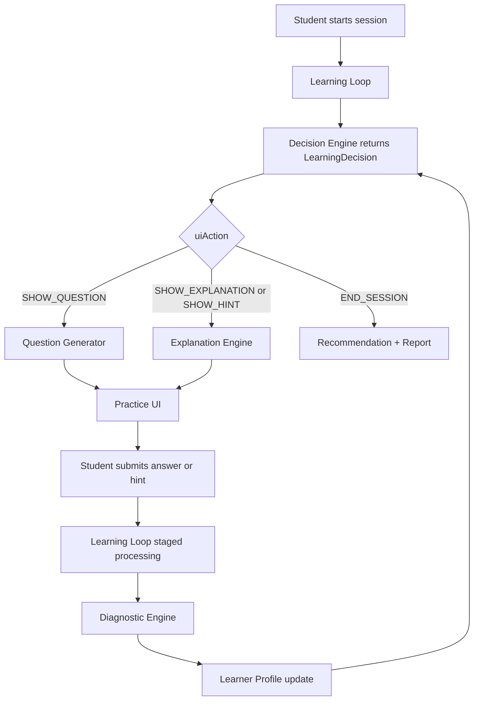

# Cogna MVP 1.0 — System Architecture

> Depends on [Shared Contracts](./README_MVP_CONTRACTS.md). Do not redefine action schemas, durability, or ownership here.

## 1. Purpose

Cogna MVP 1.0 is a **student-first, B2C learning companion** for Grade 8 CBSE Mathematics, scoped to the **Linear Equations Learning Unit**.

Core hypothesis:

> Can Cogna observe how a student answers mathematics questions, build a useful evidence-based learner profile, and adapt the next learning action in a way that improves learning?

Cogna is not a chatbot, LMS, video-course platform, or school-management product.

MVP focus:

- one user: the student
- one buyer: the parent
- one subject: Mathematics
- one curriculum: CBSE
- one learning unit: Linear Equations (including required prerequisites)
- one core loop: observe → infer → decide → adapt

---

## 2. Target Audience

### Primary user

- Students aged 13–15, Grade 8 CBSE
- May have hidden conceptual gaps
- Needs a system that remembers how they learn

### Primary buyer

- Parents — proof of improvement, simple progress visibility, early gap identification
- Parent owns account and billing (see Contracts §17)

### Secondary beneficiaries

- Teachers/tutors may receive exports later — not MVP customers

---

## 3. Learning Unit and Concept Map

See Contracts §7 for bank scope.

```text
integer-addition-subtraction
→ negative-numbers
→ arithmetic-operations
→ variables-and-constants
→ simple-expressions
→ equality-and-balancing
→ one-step-equations
→ two-step-equations
```

Optional if bank coverage exists: equations with brackets, word-problem translation.

**Concept** vs **difficulty**: Contracts §4. Difficulty is always within-concept (1–5).

---

## 4. Core Product Loop



Report Generator is **not** on the per-answer path (Contracts §13).

---

## 5. Modules

### Orchestrator

- Learning Loop

### Fully active engines

1. Question Generator
2. Diagnostic Engine
3. Decision Engine

### Minimal but active

4. Explanation Engine (templates + hints)
5. Recommendation Engine (revision proposals)
6. Report Generator (session summary)
7. Revision Service (queue write/dedupe/status)

Ownership matrix: Contracts §3.

---

## 6. Technology Architecture

### Frontend

- Next.js, React, TypeScript, Tailwind CSS, mobile-first

### Backend

- NestJS, TypeScript, REST API, **modular monolith**

### Database

- PostgreSQL, Prisma ORM

### Auth

- Supabase Auth or Clerk
- Parent and student roles; parent creates student profiles

### Infrastructure

- Vercel (frontend)
- Railway / Render / Fly.io (API)
- Managed PostgreSQL
- Sentry, PostHog

### AI usage

- LLM optional for language polishing only

---

## 7. Suggested Backend Layout

```text
apps/api/src/
├── auth/
├── students/
├── parents/
├── sessions/
├── attempts/
├── concepts/
├── questions/
├── learning-loop/
├── engines/
│   ├── question-generator/
│   ├── diagnostic-engine/
│   ├── decision-engine/
│   ├── explanation-engine/
│   ├── recommendation-engine/
│   └── report-generator/
├── revision/          # Revision Service
├── learner-profile/
├── reports/
├── analytics/
└── common/
    └── contracts/     # LearningDecision, processing states, etc.
```

Shared TypeScript types for Contracts §1–2 live in `common/contracts` and are imported by every engine.

---

## 8. Core Data Model (MVP)

Align field names with Contracts. Prefer `LearnerProfile` in new code (Contracts §18).

### Essential entities

- `User`, `Student`, `Parent`
- `Concept` — `id`, `name`, `topic`, `prerequisiteConceptIds`
- `Question` — stem, type, correctAnswer, conceptId, difficulty (1–5 within concept), questionIntent tags, misconceptionsTested, prerequisiteConceptIds, hintLadder, solutionSteps, reviewStatus, version
- `LearningSession` — includes `sessionMode`: `BASELINE` | `ADAPTIVE_PRACTICE`
- `Attempt` — eventId, grade, timings, hintCount, highestHintLevel, selfRatedConfidence (1–5 | null), answerChangedBeforeSubmit, processingStatus
- `MasteryScore` — value, confidence, modelVersion
- `DiagnosticFactor` — factorType, factorKey, value, confidence, reasoning, evidenceAttemptIds, alternativeExplanations, modelVersion
- `MisconceptionRemediationState` — per student+misconception+concept: UNCONFIRMED | TARGETING | EXPLANATION_REQUIRED | RETESTING | RESOLVED | STILL_ACTIVE
- `LearnerProfile` — masterySummary, activeMisconceptions, confidenceCalibration, hintDependence, recentLearningVelocity, revisionNeeds (signals only), updatedAt
- `LearningDecision` — full shared schema (Contracts §1), inputSnapshot, createdAt
- `RevisionQueueItem` — written only by Revision Service
- `Explanation` — approved templates linked to concept/misconception/style
- `Report` — audience, period, structuredData, renderedText, version

---

## 9. API Surface

### Session

- `POST /sessions` — may set `sessionMode: BASELINE`
- `POST /sessions/:id/end`
- `GET /sessions/:id`

### Practice

- `GET /practice/next`
- `POST /practice/answer`
- `POST /practice/hint` — Learning Loop → Explanation Engine (Contracts §5)
- `POST /practice/skip`

### Learner profile

- `GET /students/:id/profile`
- `GET /students/:id/mastery`
- `GET /students/:id/revision-queue`

### Reports

- `GET /students/:id/reports/latest`
- `POST /students/:id/reports/generate` — parent-requested or internal job only

### Parent

- `GET /parents/me/students`
- `GET /parents/me/students/:studentId/summary`

---

## 10. Answer Submission Sequence

Uses staged durability (Contracts §2):

```text
1. UI sends ANSWER_SUBMITTED with unique eventId
2. Loop validates → RECEIVED / VALIDATED
3. Idempotency check
4. Tx1: store attempt + grade → GRADED
5. Tx2: Diagnostic Engine → profile update → PROFILE_UPDATED
6. Tx3: Decision Engine → LearningDecision → DECIDED
7. Tx4: route by uiAction → content → CONTENT_RESOLVED → COMPLETED
8. Return one next action to UI
9. Full chain replayable via eventId + versions
```

---

## 11. Real-Time vs Controlled

### Updates in real time (per staged success)

- Mastery estimates, misconception confidence/state, hint dependence, confidence calibration, revision *signals*, next LearningDecision

### Does not change in real time

- Global model weights, diagnostic rules, decision policies, question difficulty definitions, safety rules

---

## 12. Safety Principles

- No clinical diagnosis; no IQ / ADHD / autism / anxiety inference
- No permanent learning-style labels
- No unreviewed generated mathematics
- Every inference has evidence + confidence
- Low-confidence findings stay uncertain
- Raw observations never overwritten
- Parent reports avoid blame; student UI hides internal negative labels
- External wording: Learner Profile / Learning Insights (Contracts §18)

---

## 13. Observability

Track: API and engine latencies, duplicate-event rate, stage failure/retry rates, fallback rate, bank coverage, % inferences with evidence, % decisions with reasoning, profile rollback/retry rate, session completion, parent report open rate.

---

## 14. UX (MVP)

### Student

1. Receives login/code from parent
2. Completes baseline (`sessionMode = BASELINE`)
3. 10–15 minute adaptive practice
4. One question at a time; optional confidence 1–5
5. Hints via approved ladder
6. Explanations only when Decision requests (or after remediation state requires)
7. Session summary
8. Later: revision queue items

### Parent

1. Creates account, trial/purchase, student profile
2. Sees session/weekly summary: practiced, improved, may need support, recommended next, certainty language

---

## 15. Explicit Anti-Scope

- Multiple subjects / full CBSE syllabus
- Teacher or school dashboards
- Open chatbot, video/animation/voice generation
- Handwriting, webcam, AR/VR, leaderboards, live classes
- Clinical diagnosis
- Custom ML training / real-time global retraining
- Microservice deployment
- General symbolic CAS grading

---

## 16. Success Criteria

### Functional acceptance

See Contracts §16 — ship blockers only.

### Pilot learning metrics

Deferred measurement / experiment design — not software acceptance gates.

---

## 17. Build Order

```text
1. Shared contracts package + DB schema
2. Reviewed Linear Equations Learning Unit bank
3. Practice UI
4. Learning Loop (staged processing)
5. Deterministic grading
6. Diagnostic Engine v1
7. Decision Engine v1 (incl. baseline + remediation states)
8. Question Generator v1
9. Explanation Engine v1 (text + hints)
10. Revision Service + Recommendation Engine v1
11. Report Generator v1 (session end)
12. Parent summary
13. Pilot instrumentation
```

---

## 18. Simplest Architecture Definition

> **Cogna MVP 1.0 is a modular student-learning system in which every answer becomes durable evidence, every piece of evidence updates an explainable learner profile through staged processing, and every profile update produces one shared LearningDecision that changes what the student sees next.**
