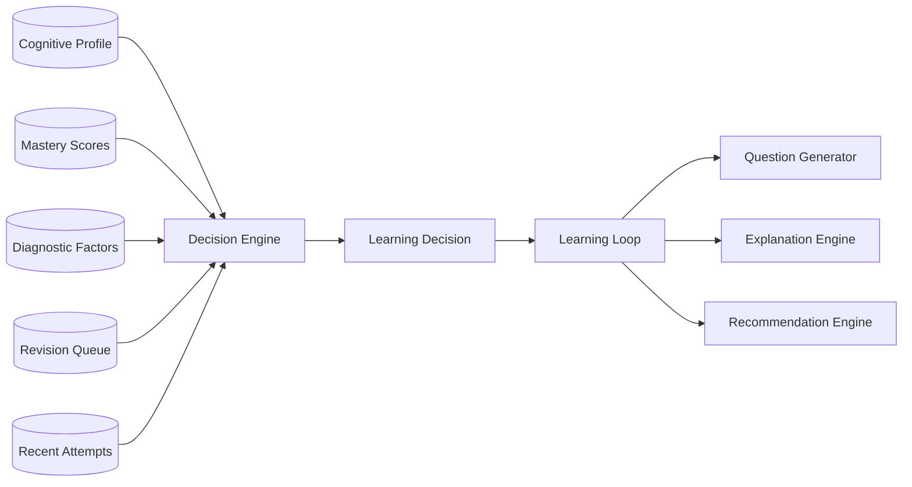
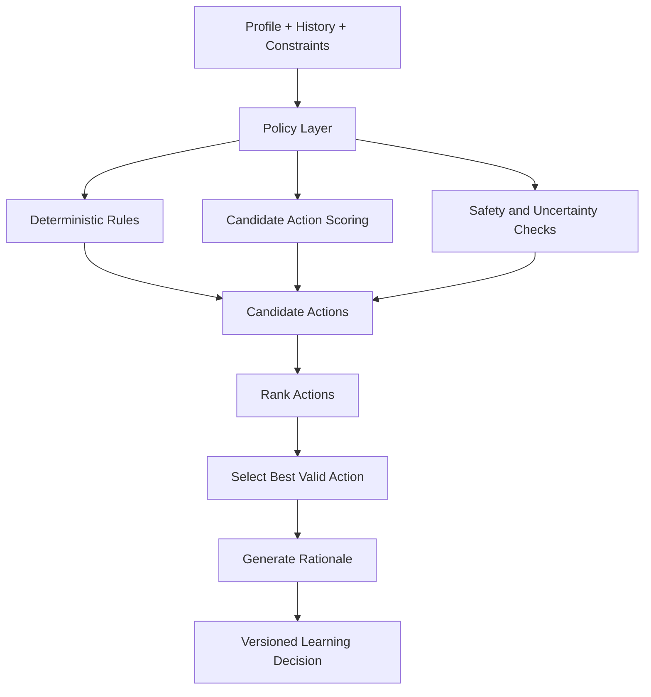

# Cogna Decision Engine

> **Future architecture only. Do not use as the MVP implementation specification.**  
> Canonical MVP 1.0: [`/docs/mvp-1.0/`](../docs/mvp-1.0/README.md) — use only `LearningDecision` (`uiAction` + `learningIntent`); never flat aliases like `EASIER_QUESTION`.

## Overview

The **Decision Engine** chooses the next best learning action based on the student's current learning state.

It answers:

> **Given what Cogna currently believes, what should happen next?**

It does not diagnose the learner and it does not generate content.

---

## Place in Cogna



---

## Final Product Goal

The mature Decision Engine should choose the learning action most likely to improve understanding, retention, confidence, and independent problem solving.

It should balance:

- Immediate learning need
- Long-term progression
- Misconception correction
- Retention
- Challenge
- Cognitive load
- Confidence calibration
- Student fatigue
- Curriculum progression
- Safety and uncertainty

The engine should optimize learning outcomes, not merely clicks or time spent.

---

## Inputs

Possible inputs:

- Active concept
- Mastery estimates
- Diagnostic factors
- Diagnostic confidence
- Recent attempts
- Revision items
- Prerequisite graph
- Question history
- Explanation history
- Session duration
- Recent difficulty
- Student goals
- Curriculum constraints
- Experiment assignment
- Safety constraints

---

## Outputs

```json
{
  "action": "SHOW_QUESTION",
  "questionIntent": "TARGET_MISCONCEPTION",
  "nextConceptId": "one-step-equations",
  "nextDifficulty": 2,
  "targetMisconception": "sign_handling",
  "preferredQuestionType": "NUMERIC",
  "confidence": 0.84,
  "reasoning": "Repeated sign-handling errors at difficulty 3. Reduce difficulty and isolate the misconception.",
  "decisionVersion": "decision-rules-v1"
}
```

---

## Possible Actions

- `EASIER_QUESTION`
- `HARDER_QUESTION`
- `SAME_DIFFICULTY`
- `TARGET_MISCONCEPTION`
- `PREREQUISITE_REVIEW`
- `REVISION`
- `VISUAL_EXPLANATION`
- `ANALOGY`
- `STEP_BY_STEP_EXPLANATION`
- `WORD_PROBLEM`
- `CONCEPT_REINFORCEMENT`
- `TRANSFER_TEST`
- `RETENTION_TEST`
- `SUGGEST_BREAK`
- `END_SESSION`
- `ESCALATE_FOR_REVIEW`

---

## Final Architecture



The mature engine may use rules, probabilistic models, contextual bandits, or reinforcement learning, but only under strict constraints and evaluation.

---

## Decision Horizon

### Immediate

What happens next, within seconds?

### Session

How should the rest of the current session be structured?

### Multi-session

What should happen over days or weeks?

The Decision Engine owns immediate action. The Recommendation Engine owns longer-horizon planning.

---

## Core Decision Logic

### Difficulty Adaptation

- Increase difficulty after repeated success with low support.
- Decrease difficulty after repeated failure.
- Avoid sudden jumps.
- Consider question quality and uncertainty.

### Misconception Targeting

When a misconception has sufficient evidence:

- Isolate it
- Test it
- Explain it
- Re-test it
- Confirm correction before clearing the flag

### Prerequisite Review

When low mastery may be caused by an earlier concept:

- Step back to the prerequisite
- Verify it
- Return to the original concept after recovery

### Revision

Prioritize concepts at risk of being forgotten.

### Confidence Calibration

- Overconfidence may trigger slower, reasoning-heavy questions.
- Underconfidence with strong performance may trigger a safe increase in challenge.
- Avoid labeling or shaming.

### Explanation Selection

Choose an explanation only when evidence suggests practice alone is insufficient.

### Session Regulation

The final engine may detect:

- Excessive struggle
- Repeated random behavior
- Session fatigue
- Need for a break
- Appropriate session ending

---

## Decision Confidence

Every decision should include:

- Confidence
- Evidence
- Alternatives considered
- Constraints applied
- Rule or model version
- Fallback status

Example:

```json
{
  "chosenAction": "PREREQUISITE_REVIEW",
  "confidence": 0.71,
  "evidence": ["low_mastery", "three_related_errors"],
  "alternatives": [
    {"action": "EASIER_QUESTION", "score": 0.62},
    {"action": "STEP_BY_STEP_EXPLANATION", "score": 0.58}
  ],
  "decisionVersion": "decision-rules-v1"
}
```

---

## Final Decision Methods

Potential future methods:

- Explicit rule systems
- Weighted candidate scoring
- Constraint satisfaction
- Contextual bandits
- Offline reinforcement learning
- Counterfactual evaluation
- Curriculum graph search
- Multi-objective optimization
- Human-in-the-loop policy review

The engine should not learn uncontrolled policies directly in production.

---

## Safety Constraints

The Decision Engine must:

- Avoid extreme difficulty jumps
- Avoid endless repetition
- Avoid punishing language
- Avoid optimizing only for engagement
- Respect curriculum and age limits
- Avoid high-impact decisions under low confidence
- Prefer safe fallback actions
- Allow human review
- Record every decision

---

## Non-Responsibilities

The Decision Engine does not:

- Grade answers
- Diagnose the student
- Generate question text
- Generate explanation text
- Write reports
- Train global models in real time
- Change raw observations
- Assign permanent learner labels

---

## Data Model

Suggested entities:

- `LearningDecision`
- `DecisionCandidate`
- `DecisionEvidence`
- `DecisionConstraint`
- `DecisionVersion`
- `RevisionQueueItem`
- `DecisionOutcome`
- `PolicyExperiment`

---

## Metrics

Track:

- Learning gain after decisions
- Repeated-error reduction
- Difficulty-transition success
- Revision effectiveness
- Explanation success
- Decision override rate
- Low-confidence decision rate
- Fallback frequency
- Student frustration indicators
- Time to mastery
- Policy performance by learner group

---

## Failure Handling

If decision computation fails:

1. Keep the learner profile unchanged.
2. Use a safe fallback.
3. Avoid increasing difficulty.
4. Select a reviewed question at the same or lower level.
5. Mark the decision as fallback-generated.
6. Log the error and policy version.

---

# Reverse Roadmap

## Final Product

- Multi-objective decision policy
- Personalized sequencing across subjects
- Learned action ranking
- Retention-aware planning
- Contextual bandits with safety constraints
- Session fatigue handling
- Cross-topic progression
- Policy experimentation
- Counterfactual evaluation
- Human override and rollback
- Outcome-based policy improvement

## Intermediate Version

- Candidate-action scoring
- Curriculum graph integration
- Revision prioritization
- Explanation selection
- Better uncertainty handling
- Session-level planning
- Decision outcome tracking
- Controlled experiments

## MVP 1.0

Use explicit rules for:

- Easier question
- Same difficulty
- Harder question
- Target misconception
- Prerequisite review
- Basic revision
- Session end

Inputs:

- Last 3–5 attempts
- Current concept mastery
- Active misconception flags
- Hint dependence
- Confidence calibration
- Revision due status

### MVP Rules

```text
2+ correct at current level
→ harder question

2+ incorrect
→ easier question

2+ incorrect and mastery < 0.3
→ prerequisite review

misconception confidence > 0.6
→ target that misconception

revision item due
→ revision before new content

mixed performance
→ same difficulty
```

All rules must be versioned and explainable.

---

## MVP Acceptance Criteria

- Every decision has a reason.
- Every decision is reproducible.
- Difficulty changes remain within safe bounds.
- Low-confidence diagnosis does not trigger aggressive adaptation.
- Misconception targeting uses reviewed questions.
- Duplicate events do not create duplicate decisions.
- Fallback works when the engine fails.
- Decision outcomes are stored for later evaluation.

---

## Simplest Definition

> **The Decision Engine turns Cogna's current understanding of the learner into the next best learning action.**
