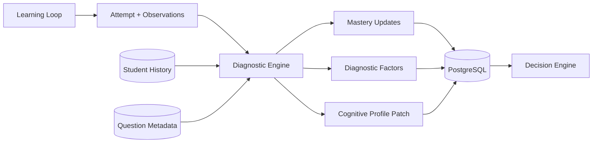
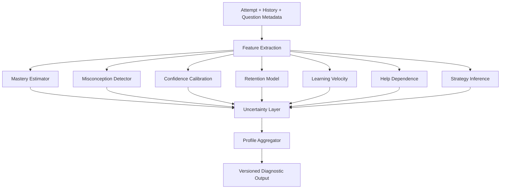

# Cogna Diagnostic Engine

> **Future architecture only. Do not use as the MVP implementation specification.**  
> Canonical MVP 1.0: [`/docs/mvp-1.0/`](../docs/mvp-1.0/README.md)

## Overview

The **Diagnostic Engine** transforms raw student interactions into structured, uncertain, and explainable estimates of the student's current learning state.

It does not decide what should happen next. It answers:

> **What does the available evidence currently suggest about this learner?**

This is the engine that learns about the student.

---

## Place in Cogna



---

## Final Product Goal

The mature Diagnostic Engine should build a continuously improving, evidence-based model of how a student is learning.

It should estimate:

- Concept mastery
- Prerequisite gaps
- Misconceptions
- Confidence calibration
- Hint dependence
- Learning velocity
- Short- and long-term retention
- Error recovery
- Transfer ability
- Problem-solving strategy
- Explanation effectiveness
- Revision readiness
- Engagement patterns
- Uncertainty in every inference

It must never confuse estimates with clinical or permanent diagnoses.

---

## Core Principle

Cogna must separate:

1. **Observation** — what happened
2. **Inference** — what Cogna believes may be true
3. **Decision** — what Cogna chooses to do

The Diagnostic Engine operates only on the second layer.

---

## Inputs

Per-attempt evidence may include:

- Correctness
- Partial correctness
- Submitted answer
- Time to first response
- Total time
- Idle time
- Number of attempts
- Hints requested
- Hint level
- Explanation viewed
- Self-rated confidence
- Answer changes
- Question difficulty
- Concept tested
- Misconceptions tested
- Prerequisites
- Session context
- Revision interval
- Recent performance history

It may also receive:

- Prior mastery estimates
- Prior diagnostic factors
- Historical response patterns
- Question item statistics
- Previous explanation outcomes
- Model and ruleset versions

---

## Outputs

```json
{
  "masteryUpdates": [
    {
      "conceptId": "one-step-equations",
      "previousValue": 0.56,
      "newValue": 0.51,
      "confidence": 0.64
    }
  ],
  "diagnosticFactors": [
    {
      "factorType": "MISCONCEPTION",
      "factorKey": "sign_handling",
      "confidence": 0.68,
      "reasoning": "Three similar sign errors in five recent attempts.",
      "evidenceAttemptIds": ["att_14", "att_18", "att_21"],
      "alternativeExplanations": [
        "arithmetic slip",
        "question misread"
      ]
    }
  ],
  "profilePatch": {
    "confidenceCalibration": "possibly_overconfident",
    "hintDependence": 0.42
  },
  "engineMetadata": {
    "diagnosticVersion": "diagnostic-rules-v1",
    "processedAt": "2026-07-10T08:00:00Z"
  }
}
```

---

## Final Architecture



The final system may contain rule-based, statistical, Bayesian, and machine-learning components. The engine is the full diagnostic system, not one model.

---

## Diagnostic Factors

### Concept Mastery

Estimate how reliably the student can apply a concept.

Should account for:

- Correctness
- Difficulty
- Hint usage
- Recency
- Repeated success
- Transfer performance
- Question quality
- Guessing likelihood
- Uncertainty

### Prerequisite Gaps

Identify whether weakness in an earlier concept explains current difficulty.

### Misconceptions

Track recurring, structured reasoning errors such as:

- Sign handling
- Incomplete isolation
- Distribution error
- Arithmetic slip
- Translation error
- Equality imbalance

### Confidence Calibration

Compare self-reported confidence with demonstrated performance.

Avoid labeling a student based on one attempt.

### Retention

Estimate whether learning survives over time.

### Learning Velocity

Estimate how quickly mastery changes under comparable practice conditions.

### Hint Dependence

Measure whether the student increasingly solves independently or relies on assistance.

### Error Recovery

Measure whether feedback changes future performance.

### Transfer Ability

Measure whether understanding works in new representations and contexts.

### Problem-Solving Strategy

Estimate observable strategy patterns without claiming fixed personality traits.

### Explanation Effectiveness

Measure whether a specific explanation style improves later performance and retention.

### Engagement Pattern

Measure practice consistency and completion behavior without diagnosing attention disorders.

---

## Evidence and Uncertainty

Every inference should store:

- Estimated value
- Confidence
- Evidence
- Rule or model version
- Timestamp
- Alternative explanations
- Validity window
- Scope

Example:

```json
{
  "factor": "sign_handling",
  "scope": "one-step-equations",
  "estimate": "likely_present",
  "confidence": 0.72,
  "evidence": ["att_12", "att_16", "att_19"],
  "alternativeExplanations": ["arithmetic_slip", "question_misread"],
  "modelVersion": "misconception-rules-v1",
  "validUntil": "2026-08-10T00:00:00Z"
}
```

---

## Final Diagnostic Methods

The mature engine may use:

- Rule-based pattern detection
- Exponential moving averages
- Bayesian Knowledge Tracing
- Item Response Theory
- Hidden Markov Models
- Retention and forgetting models
- Supervised misconception classifiers
- Sequence models
- Calibration models
- Causal or experimental evaluation
- Human feedback loops
- Confidence estimation and abstention

Models should be trained and validated offline. Student profiles update in real time, but global models should not retrain blindly after every answer.

---

## Learner Profile

The Diagnostic Engine may update:

- Concept mastery map
- Prerequisite graph state
- Active misconceptions
- Confidence calibration
- Retention estimates
- Learning velocity
- Explanation effectiveness
- Hint dependence
- Engagement summary
- Revision status
- Diagnostic uncertainty
- Last updated time

The learner profile is dynamic, versioned, and reversible.

---

## Guardrails

The Diagnostic Engine must not infer:

- IQ
- ADHD
- Autism
- Depression
- Clinical anxiety
- Personality type
- Mental-health conditions
- Permanent learning style
- Intelligence category

It must not present weak evidence as certainty.

---

## Human Review

The final system should support:

- Expert review of diagnostic rules
- Teacher or researcher confirmation
- Disagreement logging
- Override with reason
- Evaluation of false positives and false negatives
- Reprocessing under new model versions

---

## Data Model

Suggested entities:

- `Attempt`
- `Observation`
- `MasteryScore`
- `MasteryHistory`
- `DiagnosticFactor`
- `DiagnosticEvidence`
- `DiagnosticAlternative`
- `CognitiveProfile`
- `ProfileVersion`
- `ModelVersion`
- `HumanReview`

---

## Metrics

Track:

- Misconception precision and recall
- Mastery prediction accuracy
- Retention prediction accuracy
- Confidence calibration error
- False-positive rate
- False-negative rate
- Percentage of low-confidence diagnoses
- Human disagreement rate
- Improvement after targeted intervention
- Diagnostic latency
- Profile-update rollback rate

---

## Failure Handling

When evidence is weak:

- Lower confidence
- Preserve alternatives
- Request a discrimination question
- Avoid strong adaptation
- Abstain when necessary

When the engine fails:

- Preserve raw evidence
- Do not write partial profile updates
- Return a safe no-change result
- Retry later
- Log model version and error

---

# Reverse Roadmap

## Final Product

- Multi-subject learner model
- Validated mastery and retention models
- Learned misconception classifiers
- Cross-session and cross-topic reasoning
- Explanation-effectiveness modeling
- Transfer and strategy analysis
- Strong uncertainty calibration
- Human review and rollback
- Global model improvement from large datasets
- Research-grade evaluation

## Intermediate Version

- Bayesian or probabilistic mastery model
- Expanded misconception taxonomy
- Retention tracking
- Explanation-effectiveness experiments
- Better confidence calibration
- Question-item statistics
- Profile versioning
- Human confirmation workflow
- Offline model evaluation

## MVP 1.0

Estimate only:

- Concept mastery
- Prerequisite gaps
- Repeated misconception patterns
- Confidence calibration
- Hint dependence
- Recent learning progress
- Basic revision need

Use:

- Explicit rules
- Simple statistics
- Recent-attempt windows
- Confidence scores
- Evidence links
- Alternative explanations
- Versioned outputs

Do not diagnose deep cognition or clinical traits.

### MVP Flow

```text
Attempt stored
→ extract observable signals
→ update rule-based mastery
→ check repeated error patterns
→ compare confidence with performance
→ estimate hint dependence
→ produce evidence-backed profile patch
→ save versioned output
```

---

## MVP Acceptance Criteria

- Every inference links to evidence.
- Every inference has a confidence score.
- One unusual attempt cannot radically change the profile.
- Repeated misconception flags can be manually inspected.
- Raw observations remain unchanged.
- Diagnostic outputs are versioned.
- Low-confidence cases are labeled uncertain.
- The engine can abstain.
- No clinical or permanent labels are generated.
- The full profile update can be replayed.

---

## Simplest Definition

> **The Diagnostic Engine turns student behavior into cautious, evidence-backed estimates of what the student currently understands, misunderstands, remembers, and needs.**
