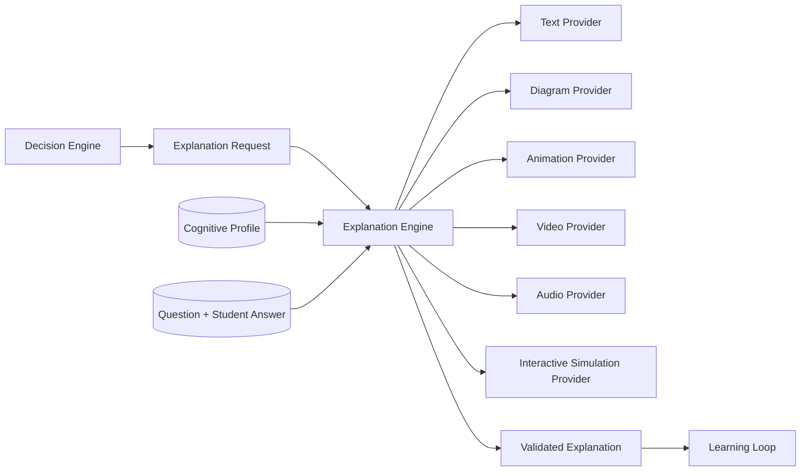
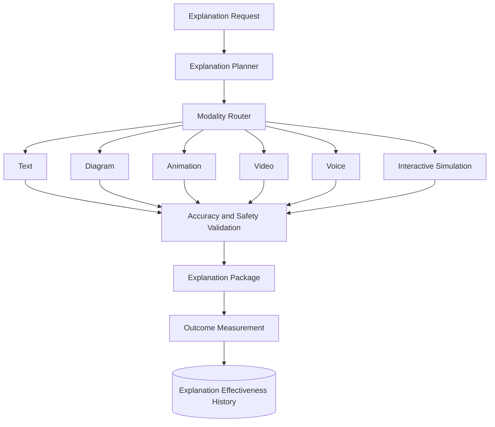

# Cogna Explanation Engine

> **Future architecture only. Do not use as the MVP implementation specification.**  
> Canonical MVP 1.0: [`/docs/mvp-1.0/`](../docs/mvp-1.0/README.md)

## Overview

The **Explanation Engine** creates the right explanation for a particular student, mistake, concept, and moment.

It answers:

> **How should this idea be explained now so that this student is most likely to understand it?**

It does not decide whether an explanation is needed. The Decision Engine makes that decision.

---

## Place in Cogna



Text, diagram, animation, video, voice, and simulations are usually providers under the Explanation Engine, not separate cognitive engines.

---

## Final Product Goal

The mature Explanation Engine should:

- Explain the exact mistake the student made
- Match the student's grade and curriculum
- Use simple, age-appropriate language
- Choose the best modality
- Avoid answer dumping
- Use the learner's history
- Target the active misconception
- Adapt length and complexity
- Support multiple languages
- Measure whether the explanation worked
- Improve modality selection over time

---

## Inputs

```json
{
  "studentId": "student_104",
  "grade": 8,
  "curriculum": "CBSE",
  "conceptId": "one-step-equations",
  "questionId": "q_204",
  "question": "Solve: x - 6 = 10",
  "studentAnswer": "x = 4",
  "correctAnswer": "16",
  "suspectedMisconception": {
    "type": "sign_handling",
    "confidence": 0.72
  },
  "requestedStyle": "STEP_BY_STEP",
  "language": "en",
  "maxLength": "short"
}
```

---

## Outputs

```json
{
  "explanation": {
    "format": "TEXT",
    "content": "The equation says 6 was subtracted from x. To undo that, add 6 to both sides...",
    "checkForUnderstanding": "What should you do to both sides first?",
    "followUpIntent": "RETRY_SIMILAR_QUESTION"
  },
  "metadata": {
    "style": "STEP_BY_STEP",
    "targetMisconception": "sign_handling",
    "providerVersion": "text-explainer-v1",
    "validationStatus": "APPROVED",
    "confidence": 0.88
  }
}
```

---

## Final Architecture



---

## Explanation Providers

### Text

- Concise explanation
- Step-by-step reasoning
- Analogy
- Worked example
- Socratic question

### Diagram

- Balance models
- Number lines
- Geometric representations
- Process diagrams

### Animation

- Motion-based explanation
- Equation balancing
- Transformations
- Dynamic graphs

### Video

- Short generated or curated video
- Voice and visual synchronization
- Reusable clips
- Personalized overlays

### Audio or Voice

- Spoken explanation
- Language support
- Accessibility

### Interactive Simulation

- Manipulable balance scale
- Drag-and-drop algebra tiles
- Visual experimentation

These may become separate backend services for scaling, but conceptually remain under the Explanation Engine.

---

## Explanation Strategy

The engine should choose:

- What misconception to target
- What to omit
- What modality to use
- How much detail to give
- Whether to ask a guiding question
- Whether to include a worked example
- What follow-up question should test understanding

---

## Hint Ladder

The engine should avoid giving the full solution immediately.

Suggested levels:

1. **Nudge** — point toward the relevant idea
2. **Guiding question** — ask what operation or principle applies
3. **Partial scaffold** — show the first step
4. **Full explanation** — only when appropriate after effort

---

## Explanation Effectiveness

The final system should learn from outcomes:

- Did the next attempt improve?
- Was the same mistake repeated?
- Was less help needed?
- Was the concept retained later?
- Did confidence become better calibrated?
- Did the student abandon the session?

The engine should avoid permanent labels such as “visual learner.” It should store evidence such as:

> Step-by-step explanations currently produce the strongest measured improvement for this concept, confidence 0.68.

---

## Validation

Every explanation should be checked for:

- Mathematical correctness
- Alignment with the student's actual mistake
- Age-appropriate language
- Curriculum consistency
- No contradiction with the answer key
- No unsafe content
- No unsupported diagnosis
- No unnecessary answer dumping
- Clear next step

---

## Data Model

Suggested entities:

- `ExplanationRequest`
- `Explanation`
- `ExplanationVersion`
- `ExplanationProvider`
- `ExplanationValidation`
- `ExplanationView`
- `ExplanationOutcome`
- `ExplanationEffectiveness`
- `MediaAsset`

---

## What It Must Never Do

The Explanation Engine must not:

- Decide when an explanation is required
- Update mastery directly
- Diagnose clinical traits
- Shame the learner
- Give a full answer immediately by default
- Generate unchecked mathematics
- Claim a fixed learning style
- Produce long lectures when a short correction is enough
- Optimize for entertainment over understanding

---

## Metrics

Track:

- Accuracy validation pass rate
- Explanation-to-improvement rate
- Repeat-error rate
- Hint dependence after explanation
- Retention after explanation
- Student abandonment
- Average explanation length
- Modality effectiveness
- Provider failure rate
- Human review disagreement

---

## Failure Handling

Fallback order:

1. Approved human-written explanation
2. Approved template-based explanation
3. Simple step-by-step explanation
4. Guiding hint
5. Ask student to retry or pause

Never return an unvalidated generated mathematical explanation if correctness is uncertain.

---

# Reverse Roadmap

## Final Product

- Multi-modal explanation planning
- Text, diagram, animation, video, voice, and simulation
- Multi-language support
- Misconception-specific explanations
- Personalized length and complexity
- Measured modality effectiveness
- Automated accuracy validation
- Reusable explanation library
- Dynamic storyboard and rendering pipeline
- Cross-subject support

## Intermediate Version

- LLM-generated text with validation
- Diagram templates
- Explanation effectiveness tracking
- Multiple explanation styles
- Better hint ladders
- Human review tools
- Limited multilingual support
- Curated media library

## MVP 1.0

- Text explanations only
- Human-written or template-based explanations
- Step-by-step and guiding-hint styles
- Linear Equations only
- Explanation linked to known misconception
- Deterministic solution steps
- Fixed hint ladder
- No generated video, animation, or voice
- Explanation shown only when Decision Engine requests it
- Follow-up question used to test whether it worked

### MVP Flow

```text
Decision Engine requests explanation
→ load question, answer, and misconception
→ select approved template
→ fill concept-specific details
→ validate against answer key
→ return short explanation
→ ask a follow-up question
→ record outcome
```

---

## MVP Acceptance Criteria

- Every explanation is mathematically correct.
- Every explanation targets the documented mistake.
- No full answer is given before the allowed hint stage.
- Explanation source and version are stored.
- The next attempt is linked to the explanation.
- Explanation effectiveness can be measured.
- Uncertain cases use a safe fallback.
- No fixed learning-style labels appear.

---

## Simplest Definition

> **The Explanation Engine turns a learning need into the clearest, safest, and most appropriate explanation for that student at that moment.**
