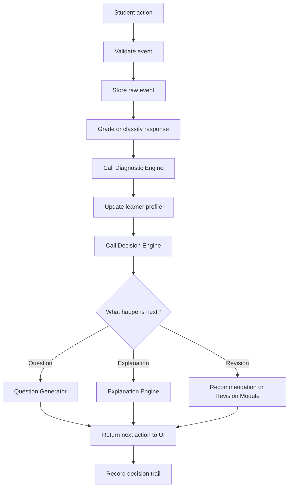

# Cogna Learning Loop

> **Future architecture only. Do not use as the MVP implementation specification.**  
> Canonical MVP 1.0: [`/docs/mvp-1.0/`](../docs/mvp-1.0/README.md)

## Overview

The **Learning Loop** is the orchestrator at the center of Cogna.

Its purpose is to ensure that every meaningful student interaction becomes:

> **Stored evidence → updated learner understanding → a better next learning action**

The Learning Loop is **not** the whole Cogna product and it is **not** an AI model. It is the backend workflow that coordinates the other engines in the correct order.

---

## Cogna vs. the Learning Loop

### Cogna

Cogna is the complete learning system. It includes:

- Student practice experience
- Learner profile
- Question bank and question generation
- Diagnostic Engine
- Decision Engine
- Explanation Engine
- Recommendation Engine
- Report Generator
- PostgreSQL database
- Parent-facing outputs
- Safety rules, privacy, monitoring, and analytics

Cogna is the complete product and intelligence architecture.

### Learning Loop

The Learning Loop is one core module inside Cogna.

It:

- Receives student actions
- Validates them
- Stores raw evidence
- Grades answers
- Calls the Diagnostic Engine
- Saves learner-profile updates
- Calls the Decision Engine
- Calls the relevant content engine
- Returns the next action
- Records why the decision was made

The Loop does not diagnose, personalize, or generate content on its own. It coordinates the modules that do.

### Simple analogy

- **Cogna is the complete orchestra.**
- **The Learning Loop is the conductor.**
- **The engines are the specialist musicians.**
- **The database is the system's memory.**
- **The practice UI is how the student enters the performance.**

---

## Core Rule

Every valid student interaction must create usable learning evidence.

No answer, hint request, skip, or revision event should disappear without being stored and evaluated.

---

## Main Learning Cycle



---

## Responsibilities

The Learning Loop is responsible for:

1. Receiving structured student events
2. Validating event integrity
3. Preventing duplicate processing
4. Preserving raw evidence
5. Grading or classifying responses
6. Calling engines in the correct order
7. Saving diagnostic updates transactionally
8. Saving decision outputs
9. Returning one clear next action
10. Recording the full audit trail
11. Handling failures safely
12. Supporting replay and debugging

---

## Events Supported

### MVP 1.0 events

- `SESSION_STARTED`
- `ANSWER_SUBMITTED`
- `HINT_REQUESTED`
- `QUESTION_SKIPPED`
- `SESSION_ENDED`

### Future events

- `EXPLANATION_VIEWED`
- `EXPLANATION_DISMISSED`
- `REVISION_COMPLETED`
- `ANSWER_CHANGED`
- `QUESTION_ABANDONED`
- `BREAK_REQUESTED`
- `PARENT_REPORT_VIEWED`
- `LEARNING_GOAL_UPDATED`

---

## Input: Student Event

A student event should be structured.

```json
{
  "eventId": "evt_01J...",
  "eventType": "ANSWER_SUBMITTED",
  "studentId": "student_104",
  "sessionId": "session_991",
  "questionId": "equation_203",
  "submittedAnswer": "x = -4",
  "timeToFirstResponseMs": 18000,
  "totalTimeMs": 62000,
  "idleTimeMs": 4000,
  "attemptNumber": 1,
  "hintCount": 1,
  "highestHintLevel": 1,
  "selfRatedConfidence": 5,
  "answerChangedBeforeSubmit": true,
  "clientTimestamp": "2026-07-10T08:00:00Z"
}
```

---

## Validation

Before processing an event, the Loop should check:

- Student exists
- Session exists
- Question exists
- Student is authorized to access the question
- Event has not already been processed
- Event belongs to the correct session
- Timing values are non-negative and plausible
- Answer is in an accepted format
- Confidence rating is inside the accepted range
- Hint levels are valid
- Required fields are present
- Client timestamp is not impossible
- Question has not expired or been invalidated

Invalid events must not silently update the learner profile.

---

## Raw Evidence Preservation

The Loop must distinguish between three things:

### 1. Observation

What actually happened.

Example:

- Student answered `x = -4`
- Took 62 seconds
- Requested one hint
- Rated confidence as 5
- Changed the answer once

### 2. Inference

What Cogna believes the evidence may indicate.

Example:

- Possible sign-handling misconception
- Possible overconfidence
- Partial concept mastery

### 3. Decision

What Cogna chooses to do next.

Example:

- Show a lower-difficulty sign-handling question
- Provide a step-by-step explanation

Observations must never be overwritten by later inferences.

---

## Grading

For MVP mathematics, grading should be deterministic whenever possible.

Possible grading outcomes:

- `CORRECT`
- `INCORRECT`
- `PARTIALLY_CORRECT`
- `INVALID_FORMAT`
- `REQUIRES_REVIEW`

The Learning Loop may use:

- Exact answer matching
- Numeric tolerance
- Algebraic equivalence checking
- Option matching for MCQs
- Rule-based short-answer parsing

---

## Diagnostic Engine Call

After grading, the Loop sends the evidence to the Diagnostic Engine.

```json
{
  "studentId": "student_104",
  "question": {
    "id": "equation_203",
    "conceptId": "one-step-equations",
    "difficulty": 3,
    "misconceptionsTested": ["sign_handling"]
  },
  "attempt": {
    "grade": "INCORRECT",
    "submittedAnswer": "x = -4",
    "totalTimeMs": 62000,
    "hintCount": 1,
    "selfRatedConfidence": 5
  },
  "recentHistoryWindow": 5,
  "diagnosticModelVersion": "diagnostic-rules-v1"
}
```

Possible output:

```json
{
  "masteryUpdates": [
    {
      "conceptId": "one-step-equations",
      "previousValue": 0.56,
      "newValue": 0.51,
      "confidence": 0.64
    }
  ],
  "diagnosticFactors": [
    {
      "factorType": "MISCONCEPTION",
      "factorKey": "sign_handling",
      "confidence": 0.68,
      "reasoning": "Three similar sign errors across five recent attempts",
      "evidenceAttemptIds": ["att_14", "att_18", "att_21"],
      "alternativeExplanations": [
        "arithmetic slip",
        "question misread"
      ]
    }
  ],
  "profilePatch": {
    "confidenceCalibration": "possibly_overconfident"
  }
}
```

---

## Learner Profile Update

Every profile update should store:

- Previous value
- New value
- Evidence used
- Confidence
- Rule or model version
- Timestamp
- Alternative explanations
- Source event IDs

Profile updates should be transactional:

> Either the attempt, diagnostic outputs, profile changes, and decision are saved successfully together, or the system rolls back safely.

One failed engine call must not leave the learner profile partially updated.

---

## Decision Engine Call

After the learner profile is updated, the Loop asks the Decision Engine:

> Given the student's current learning state, what should happen next?

```json
{
  "studentId": "student_104",
  "activeConceptId": "one-step-equations",
  "currentDifficulty": 3,
  "recentAttempts": 5,
  "mastery": 0.51,
  "activeDiagnostics": [
    {
      "factorKey": "sign_handling",
      "confidence": 0.68
    }
  ],
  "revisionItemsDue": [],
  "decisionModelVersion": "decision-rules-v1"
}
```

Example response:

```json
{
  "action": "SHOW_QUESTION",
  "questionIntent": "TARGET_MISCONCEPTION",
  "nextConceptId": "one-step-equations",
  "nextDifficulty": 2,
  "targetMisconception": "sign_handling",
  "confidence": 0.84,
  "reasoning": "Recent incorrect answers indicate a repeated sign-handling error. Reduce difficulty and isolate the suspected misconception."
}
```

---

## Possible Next Actions

- `SHOW_QUESTION`
- `SHOW_EXPLANATION`
- `SHOW_HINT`
- `START_REVISION`
- `REVIEW_PREREQUISITE`
- `CONTINUE_SAME_LEVEL`
- `INCREASE_DIFFICULTY`
- `DECREASE_DIFFICULTY`
- `END_SESSION`
- `SUGGEST_BREAK`
- `ESCALATE_FOR_REVIEW`

The student interface should receive one clear action at a time.

---

## Content Engine Routing

Depending on the Decision Engine output, the Loop calls:

### Question Generator

When the next action requires another problem.

### Explanation Engine

When the student needs a targeted explanation.

### Recommendation Engine

When a future revision or longer-term plan must be created.

### Report Generator

Usually at the end of a session, day, or week—not necessarily after every question.

---

## Output to the Practice UI

```json
{
  "action": "SHOW_QUESTION",
  "question": {
    "id": "equation_204",
    "stem": "Solve: x - 6 = 10",
    "type": "NUMERIC",
    "difficulty": 2
  },
  "studentMessage": "Let's try one that focuses on the same idea.",
  "decisionMetadata": {
    "reasonCode": "TARGET_SIGN_HANDLING",
    "decisionId": "decision_882"
  }
}
```

The UI should not expose internal labels such as “overconfident student” or “low mastery.” Internal intelligence should produce a calm, natural student experience.

---

## Decision Trail and Auditability

For every processed event, Cogna should be able to reconstruct:

- Raw event received
- Validation result
- Grading result
- Diagnostic Engine version
- Diagnostic output
- Previous profile state
- Updated profile state
- Decision Engine version
- Decision output
- Content engine called
- Final action returned
- Processing duration
- Failures or fallbacks used

This is necessary for debugging, safety, research, model validation, parent trust, future training data, rollback, and compliance.

---

## Idempotency

The same event must never update the student twice.

Each event should have a unique `eventId`.

```text
If eventId already processed:
    return stored result
    do not grade again
    do not update mastery again
    do not make a new decision
```

---

## Failure Handling

### Diagnostic Engine failure

- Save the raw attempt
- Do not apply a partial profile update
- Use a safe fallback decision
- Mark event for retry
- Log the error
- Never invent a diagnosis

### Decision Engine failure

- Preserve the profile update
- Use a safe question-selection fallback
- Avoid sudden difficulty jumps
- Log the failure
- Mark decision as fallback-generated

### Question Generator failure

- Pull a safe reviewed question from the bank
- If none exists, end or pause the session safely
- Do not serve an unverified generated question

### Database failure

- Return a retryable error
- Do not claim the answer was processed
- Do not lose the client event
- Allow idempotent resubmission

---

## Safe Fallback Policy

MVP fallback order:

1. Reviewed question matching current concept and difficulty
2. Reviewed question at the same concept and lower difficulty
3. Reviewed prerequisite question
4. End session with a safe message

Never fall back to an unchecked LLM-generated mathematics question.

---

## Privacy and Child Safety

The Learning Loop should:

- Collect only necessary learning signals
- Avoid clinical or psychological diagnoses
- Avoid permanent labels
- Keep raw evidence separate from interpretation
- Encrypt sensitive data
- Support deletion and retention controls
- Store consent status
- Avoid exposing internal diagnostic labels to students
- Record who or what accessed learner data
- Restrict access by role

---

## Monitoring

Track:

- Processing latency
- Event-validation failure rate
- Duplicate-event rate
- Diagnostic failure rate
- Decision failure rate
- Fallback frequency
- Profile-update rollback rate
- Question-bank exhaustion rate
- Average time from submission to next action
- Percentage of decisions with human-readable reasoning

---

## Versioning

Every diagnostic and decision should store the version used.

Examples:

- `diagnostic-rules-v1`
- `mastery-formula-v1`
- `decision-rules-v1`
- `question-selector-v1`

This allows Cogna to compare versions, reproduce old decisions, roll back bad releases, reprocess historical evidence, and run controlled experiments.

---

## MVP 1.0 Scope

MVP 1.0 supports:

- One subject: Mathematics
- One curriculum: CBSE
- One starting domain: Linear Equations
- A reviewed question bank
- Rule-based Diagnostic Engine
- Rule-based Decision Engine
- Synchronous processing
- One learner profile per student
- Basic evidence and audit history
- Five event types
- Deterministic grading
- Safe fallbacks
- Idempotent submissions

### MVP 1.0 flow

```text
Student submits answer
↓
Event is validated
↓
Attempt is stored
↓
Answer is graded
↓
Diagnostic Engine updates learning-state estimates
↓
Profile update is saved
↓
Decision Engine chooses the next action
↓
Question Bank returns the next reviewed question
↓
Student sees the next action
```

---

## Intermediate Version

Later versions add:

- Explanation Engine integration
- Revision planning
- Session-end recommendations
- Asynchronous processing
- Retry queues
- Multiple diagnostic versions
- Controlled experiments
- Parent report triggers
- More event types
- More concepts and subjects

---

## Mature Learning Loop

The final Learning Loop should support:

- Multiple subjects
- Multiple curricula
- Multiple learning activity types
- Real-time and delayed processing
- Distributed event queues
- Engine retries and circuit breakers
- Rollback of incorrect profile updates
- Controlled A/B tests
- Model and ruleset versioning
- Cross-device synchronization
- Offline event recovery
- Consent-aware processing
- Complete audit trails
- Safety monitoring
- Human review workflows
- Replay of historical sessions
- Multiple specialized learning loops

---

## Non-Responsibilities

The Learning Loop must not:

- Diagnose the student itself
- Generate questions itself
- Write explanations itself
- Decide difficulty itself
- Assign permanent cognitive labels
- Call an LLM for every action
- Hide failures
- Overwrite raw evidence
- Process the same event twice
- Make clinical or mental-health claims
- Allow one unusual event to radically change the learner profile

---

## Acceptance Criteria

The MVP Learning Loop works when:

- Every valid answer creates exactly one attempt
- Duplicate submissions do not create duplicate updates
- Every graded attempt leads to one diagnostic run
- Every profile update includes evidence and confidence
- Every successful profile update leads to one decision
- Every decision has a readable reason
- The next action is returned consistently
- Engine failures do not corrupt the profile
- Raw evidence is never overwritten
- The entire sequence can be replayed later
- A safe reviewed question is used if generation fails
- All model and rule versions are stored

---

## Simplest Definition

> **The Learning Loop ensures that nothing a student does is wasted: every meaningful interaction becomes stored evidence, updates Cogna's understanding, and influences what happens next.**
