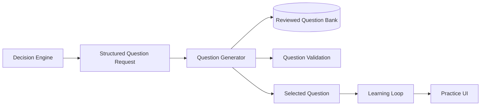
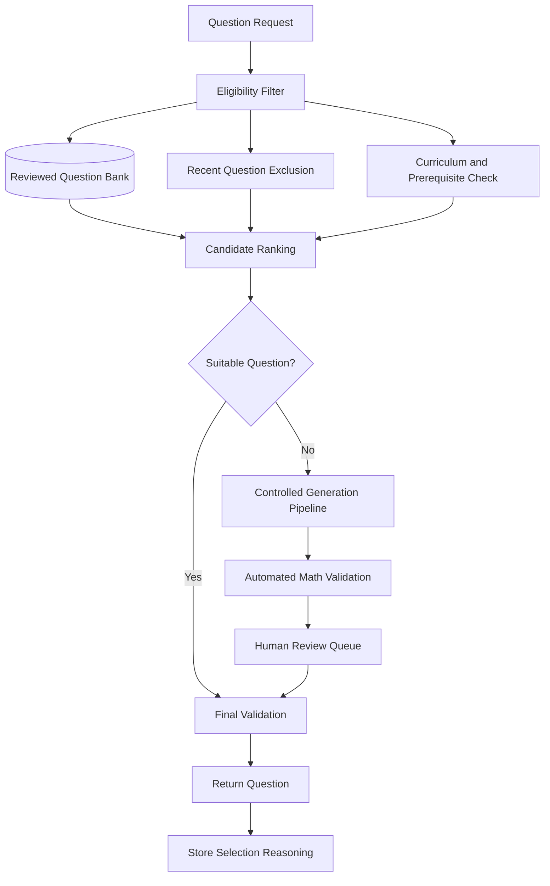

# Cogna Question Generator

> **Future architecture only. Do not use as the MVP implementation specification.**  
> Canonical MVP 1.0: [`/docs/mvp-1.0/`](../docs/mvp-1.0/README.md)

## Overview

The **Question Generator** converts a learning intention into the exact question a student should see next.

It does not decide what the student needs. The **Decision Engine** decides the learning action. The Question Generator finds, ranks, validates, or creates the question that best carries out that action.

> **Decision Engine:** What should happen next?  
> **Question Generator:** Which question should perform that action?

---

## Place in Cogna



The Question Generator receives a structured request from the Decision Engine and returns a structured, validated question to the Learning Loop.

---

## Final Product Goal

The mature Question Generator should provide the most informative and instructionally useful question for a specific student at a specific moment.

It should support:

- Initial diagnostic questions
- Standard practice questions
- Misconception-targeting questions
- Prerequisite checks
- Retention questions
- Transfer questions
- Confidence-calibration questions
- Challenge questions
- Word problems
- Multi-step reasoning questions
- Curriculum-aligned assessments
- Questions in multiple languages and representations

The system should eventually improve question selection using measured learning outcomes, not merely student engagement.

---

## Core Inputs

A structured request may contain:

```json
{
  "studentId": "student_104",
  "curriculum": "CBSE",
  "grade": 8,
  "subject": "mathematics",
  "topicId": "linear-equations",
  "conceptId": "one-step-equations",
  "difficulty": 2,
  "questionIntent": "TARGET_MISCONCEPTION",
  "targetMisconception": "sign_handling",
  "questionType": "NUMERIC",
  "recentQuestionIds": ["q_101", "q_102"],
  "requiredPrerequisites": ["integer-addition"],
  "language": "en"
}
```

The Question Generator should receive only the context needed to select a question. It should not receive the entire learner profile unless necessary.

---

## Core Outputs

```json
{
  "question": {
    "id": "q_204",
    "stem": "Solve: x - 6 = 10",
    "type": "NUMERIC",
    "difficulty": 2,
    "conceptId": "one-step-equations",
    "correctAnswer": "16",
    "hintLadder": [
      "What operation is being applied to x?",
      "Use the opposite operation on both sides.",
      "Add 6 to both sides."
    ]
  },
  "selectionMetadata": {
    "intent": "TARGET_MISCONCEPTION",
    "targetMisconception": "sign_handling",
    "source": "QUESTION_BANK",
    "selectorVersion": "question-selector-v1",
    "selectionConfidence": 0.91,
    "reasoning": "Matches concept, difficulty, and suspected sign-handling error."
  }
}
```

---

## Final Architecture



---

## Question Types

### Standard Practice

Checks normal application of a concept.

### Misconception Targeting

Designed to expose or correct a suspected error pattern.

### Prerequisite Check

Tests whether an earlier missing concept is causing the current difficulty.

### Retention Test

Checks whether previously learned knowledge remains available after a delay.

### Transfer Question

Tests whether the student can apply an idea in an unfamiliar form.

### Confidence Calibration

Compares expected difficulty, actual performance, and self-reported confidence.

### Discrimination Question

Distinguishes between competing explanations for a student's mistake.

For example, a carefully chosen question may separate a sign-handling misconception from a general arithmetic weakness.

---

## Question Metadata

Each question should contain:

- Question ID
- Curriculum
- Grade
- Subject
- Topic
- Concept
- Sub-concept
- Difficulty
- Question type
- Question intent
- Correct answer
- Deterministic grading rules
- Misconceptions tested
- Prerequisites
- Solution steps
- Hint ladder
- Estimated reading load
- Source
- Review status
- Version
- Quality score
- Historical item statistics
- Language
- Accessibility metadata

A question without metadata is only content. A question with structured metadata becomes usable evidence for the cognitive system.

---

## Difficulty Model

Difficulty must not be guessed from the size of numbers alone.

It may depend on:

- Number of operations
- Negative values
- Fractions
- Variables on both sides
- Brackets
- Language complexity
- Irrelevant information
- Required prerequisites
- Degree of abstraction
- Transfer demand
- Time pressure
- Familiarity of representation

For MVP Linear Equations:

### Difficulty 1
- One-step equations
- Positive integers
- Direct operations

### Difficulty 2
- Subtraction
- Negative values
- Simple division

### Difficulty 3
- Two-step equations
- Mixed operations
- Larger values

### Difficulty 4
- Brackets
- Fractions
- Variables on both sides

### Difficulty 5
- Multi-step word problems
- Transfer questions
- Unfamiliar representations

---

## Selection Logic

The mature selector should:

1. Match the requested curriculum, grade, concept, and intent.
2. Exclude invalid, retired, or low-quality questions.
3. Avoid accidental repetition.
4. Check prerequisites.
5. Match the requested difficulty.
6. Prefer questions that provide useful diagnostic evidence.
7. Prefer questions with reliable historical item statistics.
8. Record why the selected question was chosen.
9. Use safe fallbacks when no exact match exists.

---

## Controlled Generation

The mature system may use an LLM to draft questions, but generated mathematics should not be shown directly without validation.

Validation should check:

- Mathematical correctness
- Unique intended answer
- Answer-key consistency
- Clear wording
- Curriculum fit
- Concept alignment
- Difficulty plausibility
- Misconception alignment
- Distractor quality
- Safety and age appropriateness

Generated content should pass automated checks and, where needed, human review.

---

## Data Model

Suggested tables or entities:

- `Question`
- `QuestionVersion`
- `QuestionConceptTag`
- `QuestionMisconceptionTag`
- `QuestionPrerequisiteTag`
- `QuestionHint`
- `QuestionSolutionStep`
- `QuestionReview`
- `QuestionUsage`
- `QuestionItemStatistic`
- `QuestionSelectionLog`

---

## What It Must Never Do

The Question Generator must not:

- Diagnose the learner
- Update mastery
- Choose the learning goal
- Decide whether an explanation is needed
- Assign psychological labels
- Serve unchecked generated mathematics
- Repeatedly show near-identical questions without purpose
- Hide why a question was selected
- Optimize only for engagement
- Expose internal diagnostic labels to the student

---

## Safety and Explainability

Every selection should store:

- Input request
- Eligible candidate set
- Excluded candidates and reason
- Selected question
- Selector version
- Confidence
- Selection rationale
- Fallback path, if used

---

## Metrics

Track:

- Question-selection latency
- Bank coverage by concept and difficulty
- Fallback frequency
- Question rejection rate
- Validation failure rate
- Accidental repetition rate
- Item difficulty calibration error
- Misconception-targeting precision
- Learning gain after selected questions
- Question quality by reviewer and source

---

## Failure Handling

Fallback order:

1. Reviewed question matching concept, intent, and difficulty
2. Reviewed question matching concept at nearby difficulty
3. Reviewed prerequisite question
4. Safe session pause or end

Never fall back to an unchecked generated question.

---

# Reverse Roadmap

## Final Product

- Dynamic, profile-aware question selection
- Multi-subject and multi-curriculum support
- Learned ranking models
- Item Response Theory or equivalent item modeling
- Automated generation with rigorous validation
- Misconception-discrimination questions
- Multi-language generation
- Personalized representation and context
- Continuous question-quality improvement
- Large reviewed content library
- Outcome-based question optimization

## Intermediate Version

- Expanded reviewed question bank
- Curriculum and prerequisite graph
- Automated validation
- Human review workflow
- Better candidate ranking
- Item performance statistics
- Retention and transfer question types
- LLM-assisted drafting
- A/B testing of question forms

## MVP 1.0

- Grade 8 CBSE Mathematics
- Linear Equations only
- Human-reviewed question bank
- MCQ and numeric questions
- Deterministic answer keys
- Difficulty levels 1–5
- Concept tags
- Misconception tags
- Prerequisite tags
- Fixed hint ladders
- Rule-based filtering
- Rule-based ranking
- Recent-question exclusion
- Safe fallback logic
- No unreviewed LLM questions

### MVP Flow

```text
Decision Engine sends request
→ filter reviewed question bank
→ remove recently seen questions
→ match concept, difficulty, and intent
→ rank eligible questions
→ return best question
→ store why it was selected
```

---

## MVP Acceptance Criteria

- Every question has a verified answer.
- Every question has concept and difficulty metadata.
- Every selected question matches the requested concept.
- Targeted questions map to a documented misconception.
- Recent questions are not repeated accidentally.
- Every selection records its rationale.
- Safe fallback works when no exact match exists.
- No unchecked generated mathematics reaches students.

---

## Simplest Definition

> **The Question Generator turns the Decision Engine's learning intention into the exact validated question that should be shown next.**
