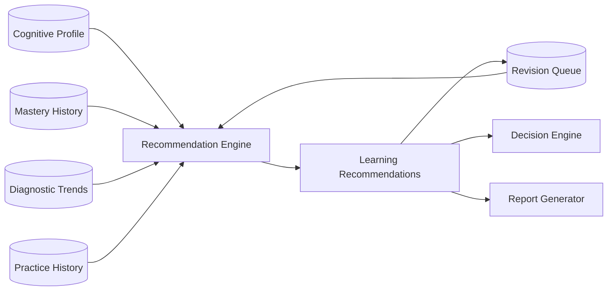
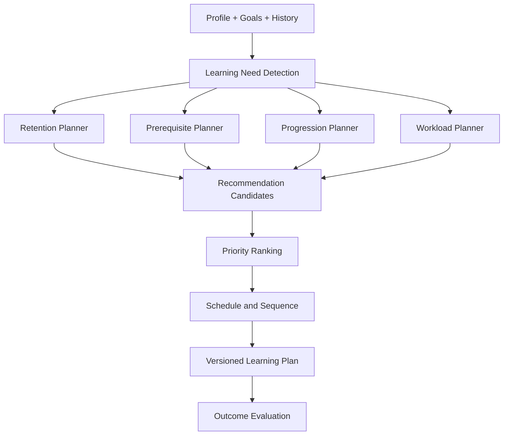

# Cogna Recommendation Engine

> **Future architecture only. Do not use as the MVP implementation specification.**  
> Canonical MVP 1.0: [`/docs/mvp-1.0/`](../docs/mvp-1.0/README.md)

## Overview

The **Recommendation Engine** plans beyond the immediate next question.

It answers:

> **What should this student focus on over the next sessions, days, or weeks?**

The Decision Engine handles the next action. The Recommendation Engine handles the longer learning plan.

---

## Place in Cogna



---

## Final Product Goal

The mature Recommendation Engine should create a personalized learning plan that balances:

- New learning
- Revision
- Prerequisite recovery
- Misconception correction
- Retention
- Challenge
- Student goals
- Curriculum deadlines
- Available study time
- Sustainable workload

It should think in days and weeks rather than seconds.

---

## Inputs

- Full cognitive profile
- Mastery across concepts
- Mastery history
- Revision history
- Diagnostic trends
- Explanation outcomes
- Practice frequency
- Session duration
- Curriculum timeline
- Student goals
- Upcoming exams
- Available time
- Parent or teacher constraints
- Recommendation history
- Previous recommendation outcomes

---

## Outputs

```json
{
  "recommendations": [
    {
      "type": "REVISION",
      "conceptId": "one-step-equations",
      "priority": 0.88,
      "scheduledFor": "2026-07-12",
      "reasoning": "Mastery decreased after six days without practice.",
      "confidence": 0.81
    },
    {
      "type": "PREREQUISITE_REVIEW",
      "conceptId": "integer-operations",
      "priority": 0.72,
      "reasoning": "Arithmetic errors continue to affect equation solving.",
      "confidence": 0.69
    }
  ],
  "planVersion": "recommendation-rules-v1"
}
```

---

## Final Architecture



---

## Recommendation Types

- Revision
- Prerequisite review
- Misconception-focused practice
- Continue current concept
- Advance to next concept
- Transfer practice
- Confidence-building challenge
- Reduce workload
- Increase challenge
- Change explanation strategy
- Schedule rest or shorter sessions
- Prepare for assessment
- Reinforce weak foundations

---

## Planning Horizons

### Session End

What should be queued for tomorrow?

### Daily

Which concepts are fading?

### Weekly

What should the student focus on this week?

### Monthly

Is the student progressing through the curriculum appropriately?

### Long Term

What learning path best supports the student's goals?

---

## Retention Planning

The mature engine should estimate when knowledge is likely to decay and schedule review before significant forgetting.

It may later use:

- Spaced repetition models
- Personalized forgetting curves
- Retrieval-strength estimates
- Interleaving
- Distributed practice
- Delayed transfer checks

---

## Priority Model

Recommendation priority may consider:

- Concept importance
- Current mastery
- Diagnostic confidence
- Time since practice
- Prerequisite centrality
- Upcoming curriculum need
- Repeated error severity
- Student goal relevance
- Estimated learning benefit
- Workload capacity

---

## Outcome Tracking

Every recommendation should later be evaluated:

- Was it completed?
- Did mastery improve?
- Did retention improve?
- Did the same misconception recur?
- Was the recommendation ignored?
- Was the workload realistic?
- Did the student return voluntarily?

The engine should learn from recommendation outcomes through controlled updates.

---

## Data Model

Suggested entities:

- `Recommendation`
- `RecommendationEvidence`
- `RecommendationOutcome`
- `LearningPlan`
- `LearningPlanItem`
- `RevisionQueueItem`
- `StudentGoal`
- `CurriculumDeadline`
- `WorkloadPreference`
- `RecommendationVersion`

---

## What It Must Never Do

The Recommendation Engine must not:

- Pick the immediate next question
- Generate question text
- Diagnose the learner
- Write parent-facing prose
- Overload the student
- Create rigid plans from weak evidence
- Ignore uncertainty
- Optimize only for streaks
- Treat recommendations as permanent

---

## Metrics

Track:

- Recommendation completion rate
- Learning gain after recommendation
- Retention improvement
- Repeat-error reduction
- Revision timing effectiveness
- Plan adherence
- Overload or abandonment
- Recommendation override rate
- Parent and student usefulness ratings
- Calibration of predicted benefit

---

## Failure Handling

If confidence is low:

- Recommend a short diagnostic activity
- Avoid major path changes
- Use conservative revision
- Ask for more evidence
- Label the recommendation uncertain

If the engine fails:

- Preserve existing plan
- Use safe revision defaults
- Avoid deleting due items
- Log the failure
- Retry later

---

# Reverse Roadmap

## Final Product

- Personalized multi-week learning plans
- Advanced spaced repetition
- Curriculum-aware scheduling
- Goal-based learning paths
- Workload optimization
- Cross-subject planning
- Personalized forgetting curves
- Learned recommendation ranking
- Outcome-based improvement
- Parent and teacher constraints
- Long-term skill progression

## Intermediate Version

- Daily revision queue
- Weekly concept plan
- Basic prerequisite planning
- Scheduled transfer checks
- Recommendation outcome tracking
- Curriculum timeline support
- Simple workload limits
- Better priority scoring

## MVP 1.0

- End-of-session revision queue
- Simple rule-based retention
- Recommend 3–5 questions for the next session
- Prioritize weak concepts
- Prioritize active misconceptions
- Add prerequisite review when needed
- No complex weekly planner
- No calendar integration
- No learned recommendation model

### MVP Rules

```text
mastery below threshold
→ add targeted practice

concept not practiced for 5+ days
→ add revision

active misconception confidence > 0.6
→ add misconception-targeted set

prerequisite weakness detected
→ add prerequisite review before progression
```

---

## MVP Acceptance Criteria

- Every recommendation has a reason.
- Every recommendation has a confidence score.
- Recommendations are linked to evidence.
- The queue respects a simple workload cap.
- Completed recommendations update outcome history.
- Low-confidence recommendations are conservative.
- The same item is not duplicated.
- Revision priority can be explained.

---

## Simplest Definition

> **The Recommendation Engine turns Cogna's understanding of the learner into a practical plan for what to study over the coming sessions, days, and weeks.**
