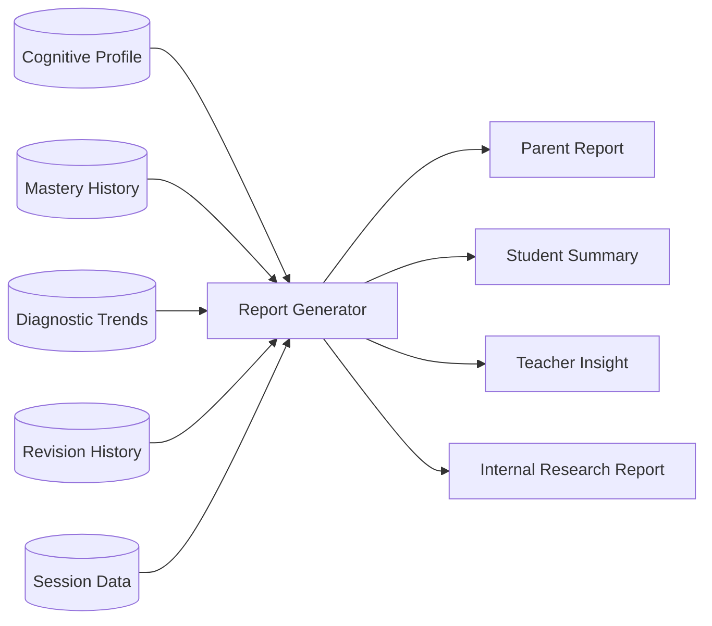
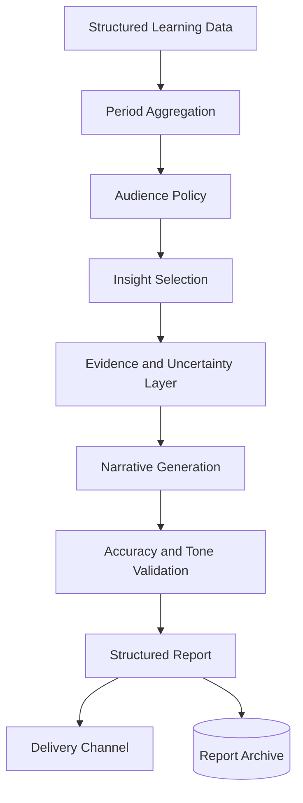

# Cogna Report Generator

> **Future architecture only. Do not use as the MVP implementation specification.**  
> Canonical MVP 1.0: [`/docs/mvp-1.0/`](../docs/mvp-1.0/README.md)

## Overview

The **Report Generator** translates Cogna's structured learner model into clear, useful communication for parents, students, teachers, and internal teams.

It answers:

> **How should Cogna explain what it knows, without jargon, overclaiming, or hiding uncertainty?**

It does not diagnose, teach, or influence live learning directly.

---

## Place in Cogna



---

## Final Product Goal

The mature Report Generator should produce trustworthy, role-specific reports that:

- Show meaningful progress
- Explain strengths and weaknesses
- Highlight uncertainty
- Avoid technical jargon
- Avoid permanent labels
- Suggest practical next steps
- Distinguish observation from inference
- Explain trends over time
- Allow evidence inspection
- Protect child privacy

---

## Audiences

### Parent

Needs a one-minute summary and clear actions.

### Student

Needs encouraging, non-judgmental progress feedback.

### Teacher

Needs concise, actionable learning evidence.

### Internal Research Team

Needs detailed model outputs, evidence, confidence, and versioning.

Different audiences require different reports from the same underlying data.

---

## Inputs

- Cognitive profile
- Mastery history
- Diagnostic factors
- Confidence scores
- Revision completion
- Practice history
- Session duration
- Explanation outcomes
- Recommendation outcomes
- Curriculum progress
- Report audience
- Reporting period
- Language
- Privacy permissions

---

## Parent Report Output

```json
{
  "period": "2026-07-01/2026-07-07",
  "summary": "Arjun improved in identifying variables and simplifying expressions. Sign errors still appear in one-step equations.",
  "strengths": [
    "Recognizes variables accurately",
    "Completes short practice sessions consistently"
  ],
  "areasForSupport": [
    "Sign handling while moving terms"
  ],
  "progress": {
    "variables": {"from": 0.61, "to": 0.83},
    "oneStepEquations": {"from": 0.42, "to": 0.49}
  },
  "confidenceNote": "Arjun sometimes feels certain even when sign handling is incorrect.",
  "suggestions": [
    "Ask Arjun to explain each operation aloud.",
    "Complete the 10-minute revision set on Thursday."
  ],
  "uncertainty": [
    "The sign-error pattern is still being confirmed."
  ]
}
```

---

## Final Architecture



---

## Report Types

- Session summary
- Daily student summary
- Weekly parent report
- Monthly progress report
- Teacher intervention summary
- Learning-history export
- Research and model-validation report
- Safety or anomaly report

---

## Communication Principles

Reports should:

- Say what changed
- Say why Cogna believes it
- Say how certain Cogna is
- Suggest what to do next
- Use plain language
- Focus on growth
- Avoid ranking and shame
- Avoid clinical language
- Avoid pretending uncertainty does not exist

---

## Observation vs. Inference

A report should distinguish:

### Observation

> Arjun answered 7 of 10 questions correctly.

### Inference

> Recent responses suggest sign handling may still need practice.

### Recommendation

> Complete a short sign-handling revision set this week.

These should not be blended into one unsupported claim.

---

## Final Report Generation Methods

The mature system may use:

- Deterministic data aggregation
- Rules for insight selection
- Templates
- LLM-assisted narrative generation
- Tone and reading-level controls
- Multilingual rendering
- Evidence citation
- Automated consistency validation
- Human review for high-impact cases

The LLM should translate structured data, not invent facts.

---

## Validation

Every report should be checked for:

- Numerical consistency
- No unsupported claims
- Correct reporting period
- Correct student
- Appropriate audience
- Privacy permissions
- Accurate confidence language
- No clinical diagnosis
- No contradiction with source data
- Clear next steps

---

## Data Model

Suggested entities:

- `Report`
- `ReportPeriod`
- `ReportAudience`
- `ReportInsight`
- `ReportEvidence`
- `ReportSuggestion`
- `ReportVersion`
- `ReportDelivery`
- `ReportView`
- `ReportFeedback`

---

## What It Must Never Do

The Report Generator must not:

- Create diagnoses
- Change the learner profile
- Decide the next learning action
- Hide uncertainty
- Shame or rank the child
- Expose sensitive internal labels unnecessarily
- Invent achievements
- Overstate model confidence
- Reveal data without permission
- Use technical jargon for parents

---

## Metrics

Track:

- Report accuracy
- Parent comprehension
- Report open rate
- Suggestion completion
- Disagreement rate
- Unsupported-claim rate
- Reading time
- Usefulness rating
- Privacy incident rate
- Narrative validation failure rate

---

## Failure Handling

If narrative generation fails:

1. Use a deterministic template.
2. Include only verified metrics.
3. Omit uncertain narrative.
4. Preserve the structured report.
5. Log the provider failure.

If data is insufficient:

- State that more evidence is needed.
- Avoid creating a strong conclusion.
- Show only verified observations.

---

# Reverse Roadmap

## Final Product

- Parent, student, teacher, and research reports
- Multi-language reporting
- Interactive evidence drill-down
- Trend explanations
- Role-based privacy controls
- LLM-assisted narrative with validation
- Custom report schedules
- Action tracking
- Report feedback loops
- Longitudinal learning history

## Intermediate Version

- Weekly parent reports
- Student session summaries
- Teacher insight summaries
- Template and LLM hybrid
- Evidence links
- Confidence language
- Report feedback
- Basic delivery by email or app

## MVP 1.0

- Simple end-of-session student summary
- Internal developer diagnostic report
- Optional basic parent summary
- Deterministic templates
- No free-form unsupported narrative
- Linear Equations only
- Show:
  - questions attempted,
  - accuracy,
  - concept practiced,
  - possible repeated error,
  - revision suggestion,
  - uncertainty note

### MVP Flow

```text
session ends
→ aggregate verified session data
→ select approved insights
→ fill deterministic template
→ validate all numbers
→ store report
→ show student summary
```

---

## MVP Acceptance Criteria

- Every number matches source data.
- Every inference links to evidence.
- Uncertainty appears clearly.
- No clinical or permanent labels are used.
- Report generation works without an LLM.
- Parent language is understandable within one minute.
- Sensitive internal details are hidden by default.
- Reports are versioned and archived.

---

## Simplest Definition

> **The Report Generator turns Cogna's structured understanding into accurate, clear, and useful communication for the right audience.**
