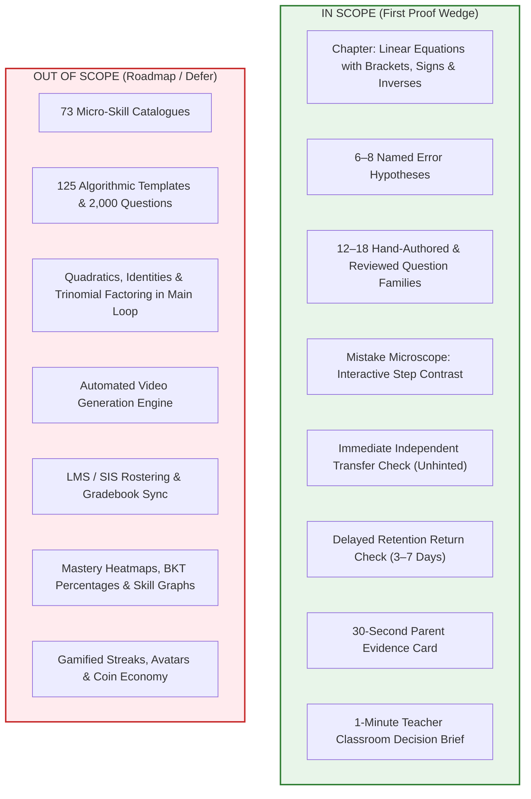

# COGNA: MVP Rescoped Specification (MVP_RESCOPED.md)

**Mission Statement:**  
> *"A Grade 8 student makes an algebra error. COGNA locates the smallest real cause, teaches it in a way the student can use, and shows an adult independent proof that it worked."*

---

## 1. Scope Boundary: What is IN vs What is OUT



---

## 2. The 6–8 Named, Observable Error Hypotheses

Each error hypothesis is tied to a deterministic verifier pattern, an interactive contrast prompt, and a discriminating transfer item.

| ID | Hypothesis Name | Concrete Example Pattern | Why Students Do It | Contrast Probe / Intervention |
|---|---|---|---|---|
| **H1** | `INCOMPLETE_DISTRIBUTION` | $3(x + 4) \;\rightarrow\; 3x + 4$ | Multiplies variable term but drops constant multiplication. | **Compare-the-steps**: Highlight $3 \times x$ and $3 \times 4$. Ask: *"Did the 3 multiply both numbers inside?"* |
| **H2** | `SIGN_DROP_NEGATIVE_BRACKET` | $-2(x + 5) \;\rightarrow\; -2x + 10$ | Multiplies $-2 \times 5$ as $+10$ instead of $-10$. | **Sign Zoom**: Visual contrast $-2 \times (+5) = -10$. Student selects the correct sign. |
| **H3** | `NEGATIVE_TERM_DISTRIBUTION` | $-(x - 3) \;\rightarrow\; -x - 3$ | Treats minus in front as only applying to $x$, keeping $-3$ unchanged. | **Hidden One**: Show $-(x - 3)$ as $-1(x - 3) \rightarrow -1(x) + -1(-3) = -x + 3$. |
| **H4** | `UNBALANCED_VARIABLE_OPERATION` | $4x - 6 = 2x + 8 \;\rightarrow\; 2x = 2$ | Combines $4x - 2x = 2x$ but subtracts $8 - 6 = 2$ instead of adding 6. | **Balance Beam**: Show that removing $2x$ leaves $2x - 6 = 8$, requiring $+6$ on both sides. |
| **H5** | `SIGN_INVERSION_ON_MOVE` | $5x + 7 = 22 \;\rightarrow\; 5x = 22 + 7$ | Adds instead of subtracting when transposing a positive constant. | **Undo Action**: Ask: *"What is the opposite of adding 7?"* Student chooses `Subtract 7`. |
| **H6** | `COEFFICIENT_SIGN_DIVISION` | $-4x = 20 \;\rightarrow\; x = 5$ | Divides by $+4$ instead of $-4$, losing the negative sign. | **Sign Rules**: Show $\frac{20}{-4} = -5$. Student verifies sign of quotient. |
| **H7** | `LIKE_TERMS_ACROSS_EQUALS` | $3x + 4 = x + 10 \;\rightarrow\; 4x = 14$ | Adds $3x + x = 4x$ across the equals sign without inverse operation. | **Side Partition**: Draw clear boundary between Left Hand Side (LHS) and Right Hand Side (RHS). |
| **H8** | `INCORRECT_ORDER_OF_OPERATIONS` | $2x + 5 = 15 \;\rightarrow\; x + 5 = 7.5$ | Divides by coefficient before undoing constant addition. | **Unwrapping Layer**: Teach "Undo constants first, then divide coefficient". |

---

## 3. The 12–18 Deeply Reviewed Question Families

| Family ID | Algebraic Structure | Exemplar Equation | Target Skills | Transfer Variation |
|---|---|---|---|---|
| **QF-01** | $a(x + b) = c$ | $3(x + 4) = 21$ | Positive bracket distribution, two-step isolation | $4(x + 3) = 28$ |
| **QF-02** | $a(x - b) = c$ | $5(x - 2) = 25$ | Positive bracket with subtraction | $2(x - 7) = 14$ |
| **QF-03** | $-a(x + b) = c$ | $-3(x + 4) = 15$ | Negative multiplier distribution | $-4(x + 2) = 16$ |
| **QF-04** | $-a(x - b) = c$ | $-2(x - 6) = 18$ | Double negative sign multiplication | $-5(x - 3) = 20$ |
| **QF-05** | $-(x + a) = b$ | $-(x + 5) = 12$ | Unit negative bracket | $-(x + 9) = 3$ |
| **QF-06** | $-(x - a) = b$ | $-(x - 8) = 14$ | Unit negative bracket with negative term | $-(x - 4) = 11$ |
| **QF-07** | $a(x + b) + c = d$ | $2(x + 3) + 4 = 18$ | Distribute then combine constant terms | $3(x + 2) + 5 = 26$ |
| **QF-08** | $a(x - b) - c = d$ | $4(x - 2) - 3 = 17$ | Distribute with multiple negative constants | $2(x - 5) - 4 = 12$ |
| **QF-09** | $ax + b = cx + d$ | $4x + 5 = 2x + 13$ | Variables on both sides (positive coefficients) | $5x + 3 = 2x + 18$ |
| **QF-10** | $ax - b = cx + d$ | $5x - 7 = 2x + 8$ | Variables on both sides with negative constant | $6x - 4 = 3x + 11$ |
| **QF-11** | $ax + b = cx - d$ | $3x + 8 = x - 4$ | Variables on both sides resulting in negative value | $4x + 10 = x - 5$ |
| **QF-12** | $a(x + b) = cx + d$ | $2(x + 4) = x + 11$ | Bracket expansion with variable on both sides | $3(x + 2) = 2x + 9$ |
| **QF-13** | $-a(x + b) = cx + d$ | $-2(x + 3) = 3x + 4$ | Negative bracket with variable on both sides | $-3(x + 1) = 2x + 7$ |
| **QF-14** | $a - (x + b) = c$ | $10 - (x + 3) = 4$ | Subtraction of bracket from leading constant | $15 - (x + 4) = 6$ |
| **QF-15** | $a - 2(x - b) = c$ | $14 - 2(x - 3) = 8$ | Leading constant with negative multiplier bracket | $20 - 3(x - 2) = 11$ |

---

## 4. The 3 Standard Intervention Modalities

1. **Compare-the-Steps (Primary):** Side-by-side presentation of the student's actual step alongside the mathematically valid step with the difference highlighted.
2. **Visual Balance Representation:** Chalkboard-style split showing LHS and RHS balance scales, illustrating why both sides must receive the identical operation.
3. **Guided Next Step (Active Prompt):** Asking the student to choose or perform the single immediate next action (e.g., *"What is $-3 \times (-4)$?"*) before resuming the problem.

---

## 5. The Measurable Pilot Learning Loop

```text
[1. Warm-Up] 2 approachable diagnostic items (2 mins)
      ↓
[2. Error Detected] First invalid step captured deterministically
      ↓
[3. Mistake Microscope] Side-by-side visual contrast + 1 active question (2 mins)
      ↓
[4. Immediate Transfer] Structurally different problem, NO hints provided (3 mins)
      ↓
[5. Earned Win] Immediate affirmation of the specific rule mastered (1 min)
      ↓
[6. 30-Second Parent Card] Sent to parent showing before/after proof
      ↓
[7. Day 4 Retrieval Check] 2-minute return problem to measure retention
```
